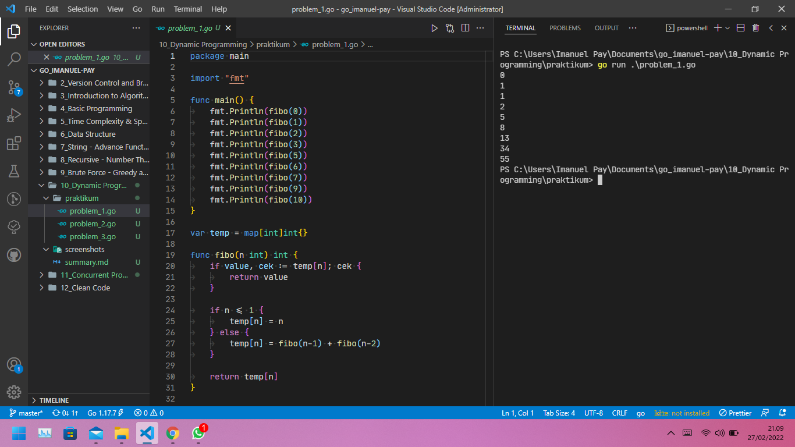
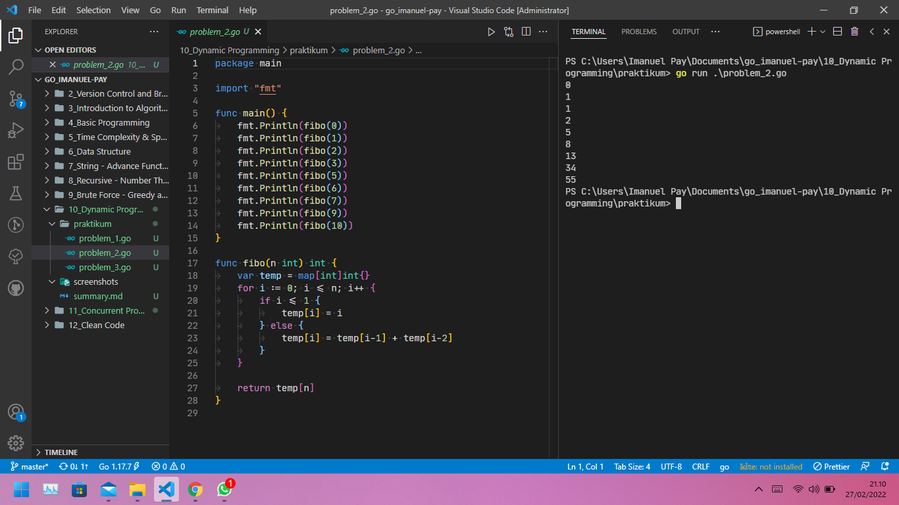
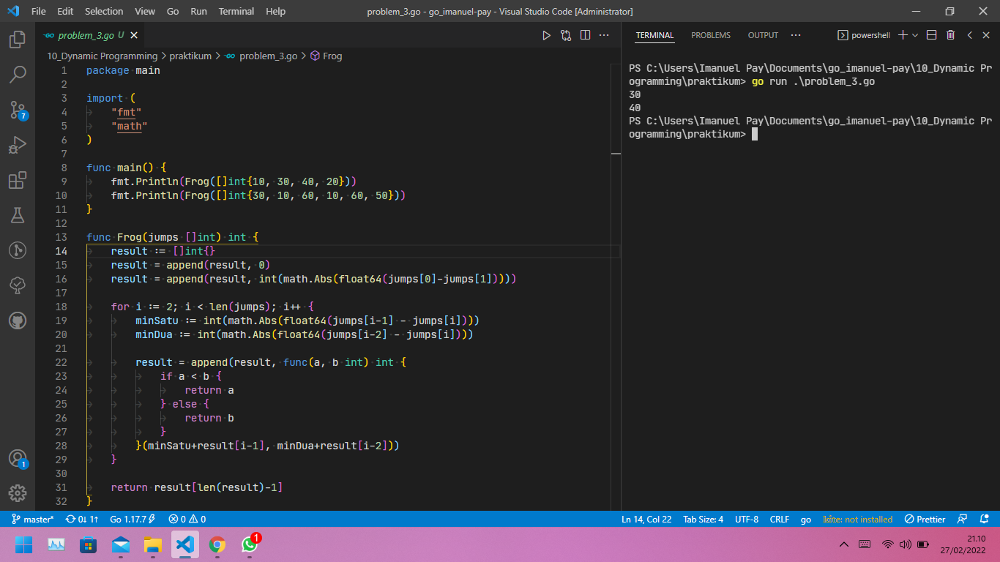

# (10) Dynamic Programming

## Resume

`Dynamic Programming` adalah teknik algoritmik untuk memecahkan masalah optimasi dengan memecahnya menjadi sub-masalah yang lebih sederhana dan solusi optimal untuk masalah keseluruhan tergantung pada solusi optimal untuk sub-masalahnya.

Karakteristik Dynamic Programming:

* `Overlapping Subproblems`, sub-masalah adalah versi yang lebih kecil dari masalah sebenarnya, setiap masalah memiliki sub masalah yang tumpang tindih jika menemukan solusinya melibatkan pemecahan sub-masalah yang sama beberapa kali.
* `Optimal Substructure Property`, Setiap masalah memiliki properti sub-struktural yang optimal jika solusi optimal keseluruhannya dapat dibangun dari solusi optimal dari sub-masalahnya.

Metode Dynamic Programming:

* `Top-down with Memoization`, dengan Top-down with Memoization, masalah yang lebih besar akan di pecahkan dengan mencari solusi secara rekursif untuk sub-masalah yang lebih kecil.
* `Bottom-up with Tabulation` adalah gabungan dari pendekatan Top-down dan menghindari rekursi. Biasanya dilakukan dengan mengisi tabel n-dimensi. berdasarkan hasil dalam tabel, solusi untuk masalah teratas/asli kemudian dihitung

## Task

### Problem 1 - Fibonacci Number Top-Down

Berikut source code dari Problem 1 - Fibonacci Number Top-Down:

[problem_1.go](praktikum/problem_1.go)

Output:

### Problem 2 - Fibonacci Number Bottom-Up

Berikut source code dari Problem 2 - Fibonacci Number Bottom-Up:

[problem_2.go](praktikum/problem_2.go)

Output:

### Problem 3 - Frog

Berikut source code dari Problem 3 - Frog:

[problem_3.go](praktikum/problem_3.go)

Output:

