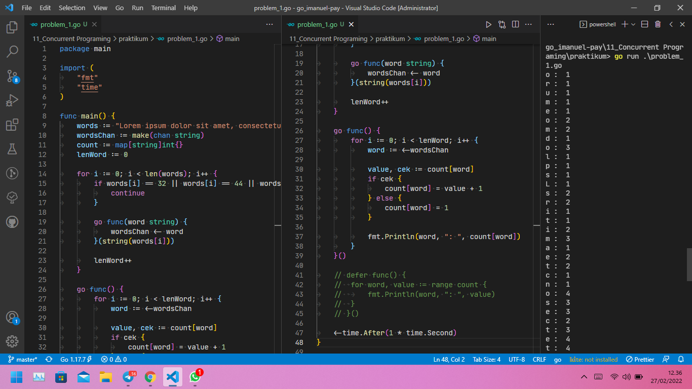

# (11) Concurrent Programing

## Resume

`Sequential Program`, sebelum tugas baru dimulai, tugas sebelumnya harus selesai. `Parallel Program`, beberapa tugas dapat dijalankan secara bersamaan (membutuhkan processor multi-core). Sedangkan `Concurrent Program` beberapa tugas dapat dijalankan secara independen dan mungkin muncul secara bersamaan.

Go's concurrency (`goroutines`) mempermudah pembuatan program paralel yang memanfaatkan processor multi-core (kebanyakan processor saat ini).

Fitur GO:

* Concurrent execution (`Goroutines`)
* Synchronization and messaging (`Channels`)
* Multi-way concurrent control (`Select`)

`Goroutines` adalah fungsi atau metode yang berjalan secara bersamaan (independen) dengan fungsi atau metode lain. Goroutines mirip dengan thread, tapi sebenarnya bukan. Sebuah native thread bisa berisikan sangat banyak goroutine.

`Channel` digunakan untuk menghubungkan goroutine satu dengan goroutine lain. Dalam komunikasinya, sebuah channel difungsikan sebagai pengirim di sebuah goroutine, dan juga sebagai penerima di goroutine lainnya. Pengiriman dan penerimaan data pada channel bersifat blocking atau synchronous.

`Select` digunakan untuk mempermudah kontrol komunikasi data lewat satu ataupun banyak channel.Cara penggunaan select untuk kontrol channel sama seperti penggunaan switch untuk seleksi kondisi.

### Goroutines pada Golang

```go
package main

import "fmt"
import "runtime"

func print(till int, message string) {
    for i := 0; i < till; i++ {
        fmt.Println((i + 1), message)
    }
}

func main() {
    runtime.GOMAXPROCS(2)

    go print(5, "halo")
    print(5, "apa kabar")

    var input string
    fmt.Scanln(&input)
}
```

Pembuatan goroutine baru ditandai dengan keyword `go`. Fungsi `runtime.GOMAXPROCS(n)` digunakan untuk menentukan jumlah core yang diaktifkan untuk eksekusi program. Jumlah yang diinputkan secara otomatis akan disesuaikan dengan jumlah asli logical processor yang ada. Jika jumlahnya lebih, maka dianggap menggunakan sejumlah prosesor yang ada.

### Channel pada Golang

```go
package main

import "fmt"
import "runtime"

func main() {
    runtime.GOMAXPROCS(2)

    var messages = make(chan string)

    var sayHelloTo = func(who string) {
        var data = fmt.Sprintf("hello %s", who)
        messages <- data
    }

    go sayHelloTo("john wick")
    go sayHelloTo("ethan hunt")
    go sayHelloTo("jason bourne")

    var message1 = <-messages
    fmt.Println(message1)

    var message2 = <-messages
    fmt.Println(message2)

    var message3 = <-messages
    fmt.Println(message3)
}
```

Cara pembuatan channel yaitu dengan menuliskan keyword `make` dengan isi keyword `chan` diikuti dengan tipe data channel yang diinginkan.

* Tanda `<-` jika dituliskan di sebelah kiri nama variabel, berarti sedang berlangsung proses pengiriman data dari variabel yang berada di kanan lewat channel yang berada di kiri.
* Tanda `<-` jika dituliskan di sebelah kiri channel, menandakan proses penerimaan data dari channel yang di kanan, untuk disimpan ke variabel yang di kiri.

### Select pada Golang

```go
package main

import "fmt"
import "runtime"

func getAverage(numbers []int, ch chan float64) {
    var sum = 0
    for _, e := range numbers {
        sum += e
    }
    ch <- float64(sum) / float64(len(numbers))
}

func getMax(numbers []int, ch chan int) {
    var max = numbers[0]
    for _, e := range numbers {
        if max < e {
            max = e
        }
    }
    ch <- max
}

func main() {
    runtime.GOMAXPROCS(2)

    var numbers = []int{3, 4, 3, 5, 6, 3, 2, 2, 6, 3, 4, 6, 3}
    fmt.Println("numbers :", numbers)

    var ch1 = make(chan float64)
    go getAverage(numbers, ch1)

    var ch2 = make(chan int)
    go getMax(numbers, ch2)

    for i := 0; i < 2; i++ {
        select {
        case avg := <-ch1:
            fmt.Printf("Avg \t: %.2f \n", avg)
        case max := <-ch2:
            fmt.Printf("Max \t: %d \n", max)
        }
    }
}
```

Cara penggunaan select untuk kontrol channel sama seperti penggunaan switch untuk seleksi kondisi. Terdapat 2 buah case kondisi penerimaan data dari kedua channel tersebut berdasarkan kode diatas.

* Kondisi `case avg := <-ch1` akan terpenuhi ketika ada penerimaan data dari channel `ch1`, yang kemudian akan ditampung oleh variabel `avg`.
* Kondisi `case max := <-ch2` akan terpenuhi ketika ada penerimaan data dari channel `ch2`, yang kemudian akan ditampung oleh variabel `max`.

## Task

### Problem 1 - Letter Frequency

Berikut source code dari Problem 1 - Letter Frequency:

[problem_1.go](praktikum/problem_1.go)

Output:


