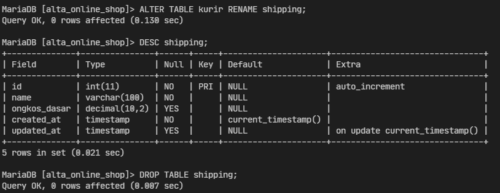

# (13) Database - DDL - DML

## Resume

Database adalah sekumpulan data yang terorganisir. Terdapat 3 Database Relationship, yaitu : `One to One`, `One to Many`, `Many to Many`. `RDBMS (Relational Database Management Systems)`, software yang menggunakan `Relational Database Model` sebagai dasarnya. Contoh: MySQL yang menggunakan `SQL`. `SQL` atau `Standard Query Language` adalah bahasa pemrograman yang digunakan dalam mengakses, mengubah, dan memanipulasi data yang berbasis relasional.

Jenis perintah pada `SQL`, seperti `DDL (Data Definition Language)`, `DML (Data Manipulation Language)` dan `DCL (Data Control Language)`. `Data Definition Language`, perintah yang digunakan untuk membuat, mengubah, mengganti nama dan menghapus sebuah Database atau tabel. Contoh perintah dari DDL: `CREATE`, `USE`, `DROP`, `RENAME`. Perintah `CREATE` digunakan untuk membuat tabel atau database. Perintah `USE` digunakan untuk menggunakan database. Perintah `DROP` digunakan untuk menghapus tabel atau database. Perintah `RENAME` digunakan untuk mengubah nama tabel atau database.

`Data Manipulation Language`, perintah yang digunakan untuk memanipulasi data dalam tabel dari suatu database. Contoh perintah dari DML: `INSERT`, `SELECT`, `UPDATE`, `DELETE`. Perintah `INSERT` digunakan untuk menambahkan data ke dalam tabel dari suatu database. Perintah `SELECT` digunakan untuk menampilkan data dari tabel dari suatu database. Perintah `UPDATE` digunakan untuk mengubah data dalam tabel dari suatu database. Perintah `DELETE` digunakan untuk menghapus data dari tabel dari suatu database. Adapun DML Statement, yaitu: `LIKE/BETWEN`, `AND/OR`, `ORDER BY` dan `LIMIT`.

## Task

### Part 1 - Schema Database

Berikut source code dari Part 1 - Schema Database:

[part_1.drawio](praktikum/part_1.drawio)

Output:

### Part 2 - Data Definition Language

Berikut SQL dari Part 2 - Data Definition Language:

[part_2.sql](praktikum/part_2.sql)

* Membuat Database `alta_online_shop` dan menambahkan tabel `user`:

    

* Membuat tabel `product`, `product_type`, dan `operators`:

    

* Membuat tabel `product_description` dan `payment_method`:

    

* Membuat tabel `transaction` dan `transaction_detail`:
  
    

* Membuat tabel `kurir` dan menambahkan kolom `ongkos_dasar` pada tabel kurir:

    

* Mengganti nama tabel `kurir` menjadi `shipping` dan menghapus tabel shipping:

    

* Membuat relasi 1-to-1 pada tabel `payment_method` dengan `payment_method_description`:

    

* Membuat relasi 1-to-many pada tabel `user` dengan `alamat`:

    

* Membuat relasi many-to-many pada tabel `user` dengan `payment_method` menjadi `user_payment_method_detail`:

    
