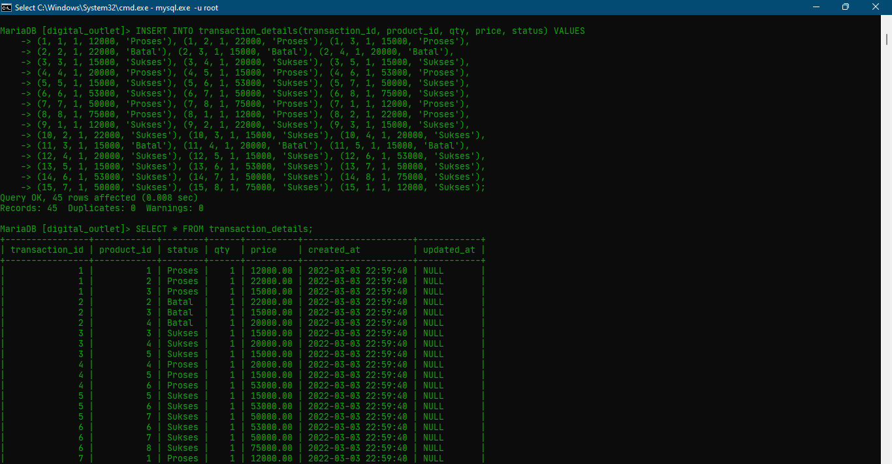

# (14) Join - Union - Agregasi - Subquery - Function (DBMS)

## Resume

* `JOIN` adalah sebuah klausa untuk mengkombinasikan record dari dua tabel atau lebih. Terdapat 3 JOIN Standar SQL ANSI, seperti `INNER JOIN`, `LEFT JOIN`, `RIGHT JOIN`.
  * `INNER JOIN` akan mengembalikan baris-baris dari dua tabel atau lebih yang memenuhi syarat.
  * `LEFT JOIN` akan mengembalikan seluruh baris dari tabel sebelah kiri yang dikenai kondisi `ON` dan hanya baris dari tabel sebelah kanan yang memenuhi kondisi `JOIN`.
  * `RIGHT JOIN` akan mengembalikan seluruh baris dari tabel sebelah kanan yang dikenai kondisi `ON` dan hanya baris dari tabel sebelah kiri yang memenuhi kondisi `JOIN`.
* `UNION` akan mengembalikan baris-baris data dengan jumlah field yang dikeluarkan/dipanggil harus sama.
* `AGGREGATE`, fungsi dimana nilai beberapa baris dikelompokkan bersama untuk membentuk nilai ringkasan tunggal. Terdapat beberapa fungsi agregasi SQL, seperti `MIN`, `MAX`, `SUM`, `AVG`, `COUNT`, `HAVING`.
  * `MIN`, fungsi untuk mendapatkan nilai minimum atau nilai terkecil dari sebuah data record di tabel.
  * `MAX`, fungsi untuk mendapatkan nilai maximum atau nilai terbesar dari sebuah data record di tabel.
  * `SUM`, fungsi untuk mendapatkan jumlah total nilai dari sebuah data record di tabel.
  * `AVG`, fungsi untuk mencari nilai rata-rata dari sebuah data record di tabel.
  * `COUNT`, fungsi untuk mencari jumlah dari sebuah data atau record di tabel.
  * `HAVING`, fungsi untuk menyeleksi data berdasarkan kriteria tertentu, dimana kriteria berupa fungsi agregasi.
* `SUB-QUERY`, Sub-Query atau Inner Query atau Nested Query adalah query di dalam query SQL lain. Digunakan untuk mengembalikan data yang akan digunakan dalam query utama sebagai syarat untuk lebih membatasi data yang akan di ambil.
* `FUNCTION` atau `TIGGER`, sekumpulan statement yang akan mengembalikan sebuah nilai balik pada pemanggilnya.

## Task

### Database Preparation

#### Membuat Database `digital_outlet`

```sql
CREATE DATABASE IF NOT EXISTS digital_outlet;
USE digital_outlet;
```

#### Membuat tabel `operators`

```sql
CREATE TABLE IF NOT EXISTS operators(
    id INT(11) NOT NULL AUTO_INCREMENT PRIMARY KEY,
    name VARCHAR(255) NOT NULL,
    created_at TIMESTAMP NOT NULL DEFAULT CURRENT_TIMESTAMP,
    updated_at TIMESTAMP NULL ON UPDATE CURRENT_TIMESTAMP
);
```

#### Membuat tabel `product_types`

```sql
CREATE TABLE IF NOT EXISTS product_types(
    id INT(11) NOT NULL AUTO_INCREMENT PRIMARY KEY,
    name VARCHAR(255) NOT NULL,
    created_at TIMESTAMP NOT NULL DEFAULT CURRENT_TIMESTAMP,
    updated_at TIMESTAMP NULL ON UPDATE CURRENT_TIMESTAMP
);
```

#### Membuat tabel `payment_methods`

```sql
CREATE TABLE IF NOT EXISTS payment_methods(
    id INT(11) NOT NULL AUTO_INCREMENT PRIMARY KEY,
    name VARCHAR(255) NOT NULL,
    status SMALLINT(1) DEFAULT NULL,
    created_at TIMESTAMP NOT NULL DEFAULT CURRENT_TIMESTAMP,
    updated_at TIMESTAMP NULL ON UPDATE CURRENT_TIMESTAMP
);
```

#### Membuat tabel `users`

```sql
CREATE TABLE IF NOT EXISTS users(
    id INT(11) NOT NULL AUTO_INCREMENT PRIMARY KEY,
    name VARCHAR(255) NOT NULL,
    status SMALLINT(1) DEFAULT NULL,
    dob DATE DEFAULT NULL,
    gender CHAR(1) DEFAULT NULL,
    created_at TIMESTAMP NOT NULL DEFAULT CURRENT_TIMESTAMP,
    updated_at TIMESTAMP NULL ON UPDATE CURRENT_TIMESTAMP
);
```

#### Membuat tabel `products` yang berelasi dengan tabel `product_types` dan `operators`

```sql
CREATE TABLE IF NOT EXISTS products(
    id INT(11) NOT NULL AUTO_INCREMENT PRIMARY KEY,
    product_type_id INT(11) NOT NULL,
    operator_id INT(11) NOT NULL,
    code VARCHAR(50) NOT NULL,
    name VARCHAR(100) NOT NULL,
    status SMALLINT(1) DEFAULT NULL,
    created_at TIMESTAMP NOT NULL DEFAULT CURRENT_TIMESTAMP,
    updated_at TIMESTAMP NULL ON UPDATE CURRENT_TIMESTAMP,

    FOREIGN KEY(product_type_id) REFERENCES product_types(id) ON UPDATE CASCADE ON DELETE CASCADE,
    FOREIGN KEY(operator_id) REFERENCES operators(id) ON UPDATE CASCADE ON DELETE CASCADE
);
```

#### Membuat tabel `product_descriptions` yang berelasi dengan tabel `products`

```sql
CREATE TABLE IF NOT EXISTS product_descriptions(
    id INT(11) NOT NULL AUTO_INCREMENT PRIMARY KEY,
    description TEXT,
    created_at TIMESTAMP NOT NULL DEFAULT CURRENT_TIMESTAMP,
    updated_at TIMESTAMP NULL ON UPDATE CURRENT_TIMESTAMP,

    FOREIGN KEY(id) REFERENCES products(id) ON UPDATE CASCADE ON DELETE CASCADE
);
```

#### Membuat tabel `transactions` yang berelasi dengan tabel `users` dan `payment_methods`

```sql
CREATE TABLE IF NOT EXISTS transactions(
    id INT(11) NOT NULL AUTO_INCREMENT PRIMARY KEY,
    user_id INT(11) DEFAULT NULL,
    payment_method_id INT(11) DEFAULT NULL,
    status VARCHAR(10) DEFAULT NULL,
    total_qty INT(11) DEFAULT 0,
    total_price DECIMAL(25,2) DEFAULT 0.0,
    created_at TIMESTAMP NOT NULL DEFAULT CURRENT_TIMESTAMP,
    updated_at TIMESTAMP NULL ON UPDATE CURRENT_TIMESTAMP,

    FOREIGN KEY(user_id) REFERENCES users(id) ON UPDATE CASCADE ON DELETE SET NULL,
    FOREIGN KEY(payment_method_id) REFERENCES payment_methods(id) ON UPDATE CASCADE ON DELETE SET NULL
);
```

#### Membuat tabel `transaction_details` yang berelasi dengan tabel `transactions` dan `products`

```sql
CREATE TABLE IF NOT EXISTS transaction_details(
    transaction_id INT(11) NOT NULL,
    product_id INT(11) NOT NULL,
    status VARCHAR(10) DEFAULT NULL,
    qty INT(11) DEFAULT 0,
    price DECIMAL(25,2) DEFAULT 0.0,
    created_at TIMESTAMP NOT NULL DEFAULT CURRENT_TIMESTAMP,
    updated_at TIMESTAMP NULL ON UPDATE CURRENT_TIMESTAMP,

    PRIMARY KEY(transaction_id, product_id),
    FOREIGN KEY(transaction_id) REFERENCES transactions(id) ON UPDATE CASCADE ON DELETE CASCADE,
    FOREIGN KEY(product_id) REFERENCES products(id) ON UPDATE CASCADE ON DELETE CASCADE
);
```

Output:


### Part 1 - Insert Data

#### A. Insert 5 operator

```sql
INSERT INTO operators(name) VALUES ('Telkomsel'), ('Indosat'), ('XL'), ('AXIS'), ('Smartfren');
```

Output:


#### B. Insert 3 product type

```sql
INSERT INTO product_types(name) VALUES ('Pulsa'), ('Paket Data'), ('Voucher');
```

Output:


#### Insert 8 product

```sql
-- C. INSERT 2 PRODUCT DENGAN TYPE ID = 1, OPERATOR ID = 2
INSERT INTO products(product_type_id, operator_id, code, name, status) VALUES 
(1, 3, 'XLP10K', 'Pulsa XL Rp.10.000', 1), 
(1, 3, 'XLP20K', 'Pulsa XL Rp.20.000', 1), 

-- D. INSERT 3 PRODUCT DENGAN TYPE ID = 2, OPERATOR ID = 1
(2, 1, 'TSELD15', 'OMG! Ketengan 2.5 GB sampai 3.7 GB', 1), 
(2, 1, 'TSELN20', 'Disney+ Hotstar! Disney+ Hotstar 3 GB MAXStream', 1), 
(2, 1, 'TSELB15', 'ZOOM 1 hari 500Mb', 1), 

-- E. INSERT 3 PRODUCT DENGAN TYPE ID = 3, OPERATOR ID = 4
(3, 4, 'AXVP50K', 'Voucher Pulsa AXIS Rp.50.000', 1), 
(3, 4, 'AXVGML50K', 'Voucher Game AXIS! 170 Diamond MLBB', 1), 
(3, 4, 'AXVGPM75K', 'Voucher Game AXIS! 325 UC PUBGM', 1);
```

Output:


#### F. Insert deskripsi product pada setiap product

```sql
INSERT INTO product_descriptions(id, description) VALUES
(1,'Harga Rp.12.000, Perpanjangan masa aktif kartu XL anda 3 hari.'),
(2,'Harga Rp.22.000, Perpanjangan masa aktif kartu XL anda 7 hari.'),
(3,'Harga Rp.15.000, Kuota 2.5 GB hingga 3.7 GB OMG! KUOTA INTERNET SESUAI ZONA USER. Masa aktif 1 hari.'),
(4,'Harga Rp.20.000, 3GB MAXStream selama 1 bulan. Sudah termasuk langganan Disney+ Hotstar 1 bulan.'),
(5,'Harga Rp.15.000, Kuota Video Conference ZOOM 500Mb. Masa aktif 1 hari.'),
(6,'Harga Rp.53.000, Voucher Pulsa AXIS Rp.50.000. Berlaku 1 kali.'),
(7,'Harga Rp.50.000, Voucher Game AXIS! 170 Diamond Mobile Legends: Bang Bang. Berlaku untuk 1 akun.'),
(8,'Harga Rp.75.000, Voucher Game AXIS! 325 UC PUBG Mobile. Berlaku untuk 1 akun.');
```

Output:


#### G. Insert 3 payment methods

```sql
INSERT INTO payment_methods(name, status) VALUES ('Transfer Bank', 1), ('Kartu Kredit/Debit', 1), ('Dompet Digital', 1);
```

Output:


#### H. Insert 5 user

```sql
INSERT INTO users(name, dob, gender, status) VALUES
('Imanuel', '2001-12-24', 'M', 1),
('Tifanny', '2003-12-11', 'F', 1),
('Yanuar', '2002-01-20', 'M', 1),
('Grace', '2000-04-15', 'F', 1),
('Elton', '2001-06-27', 'M', 1);
```

Output:


#### I. Insert 3 transaksi pada masing-masing user

```sql
INSERT INTO transactions(user_id, payment_method_id, total_qty, total_price, status) VALUES
(1, 1, 3, 49000, 'Proses'), (1, 2, 3, 57000, 'Batal'), (1, 3, 3, 50000, 'Sukses'),
(2, 1, 3, 88000, 'Proses'), (2, 2, 3, 118000, 'Sukses'), (2, 3, 3, 178000, 'Sukses'),
(3, 1, 3, 137000, 'Proses'), (3, 2, 3, 109000, 'Proses'), (3, 3, 3, 49000, 'Sukses'),
(4, 1, 3, 57000, 'Sukses'), (4, 2, 3, 50000, 'Batal'), (4, 3, 3, 88000, 'Sukses'),
(5, 1, 3, 118000, 'Sukses'), (5, 2, 3, 178000, 'Sukses'), (5, 3, 3, 137000, 'Sukses');
```

Output:


#### J. Insert 3 product pada masing-masing transaksi

```sql
INSERT INTO transaction_details(transaction_id, product_id, qty, price, status) VALUES
(1, 1, 1, 12000, 'Proses'), (1, 2, 1, 22000, 'Proses'), (1, 3, 1, 15000, 'Proses'),
(2, 2, 1, 22000, 'Batal'), (2, 3, 1, 15000, 'Batal'), (2, 4, 1, 20000, 'Batal'),
(3, 3, 1, 15000, 'Sukses'), (3, 4, 1, 20000, 'Sukses'), (3, 5, 1, 15000, 'Sukses'),
(4, 4, 1, 20000, 'Proses'), (4, 5, 1, 15000, 'Proses'), (4, 6, 1, 53000, 'Proses'),
(5, 5, 1, 15000, 'Sukses'), (5, 6, 1, 53000, 'Sukses'), (5, 7, 1, 50000, 'Sukses'),
(6, 6, 1, 53000, 'Sukses'), (6, 7, 1, 50000, 'Sukses'), (6, 8, 1, 75000, 'Sukses'),
(7, 7, 1, 50000, 'Proses'), (7, 8, 1, 75000, 'Proses'), (7, 1, 1, 12000, 'Proses'),
(8, 8, 1, 75000, 'Proses'), (8, 1, 1, 12000, 'Proses'), (8, 2, 1, 22000, 'Proses'),
(9, 1, 1, 12000, 'Sukses'), (9, 2, 1, 22000, 'Sukses'), (9, 3, 1, 15000, 'Sukses'),
(10, 2, 1, 22000, 'Sukses'), (10, 3, 1, 15000, 'Sukses'), (10, 4, 1, 20000, 'Sukses'),
(11, 3, 1, 15000, 'Batal'), (11, 4, 1, 20000, 'Batal'), (11, 5, 1, 15000, 'Batal'),
(12, 4, 1, 20000, 'Sukses'), (12, 5, 1, 15000, 'Sukses'), (12, 6, 1, 53000, 'Sukses'),
(13, 5, 1, 15000, 'Sukses'), (13, 6, 1, 53000, 'Sukses'), (13, 7, 1, 50000, 'Sukses'),
(14, 6, 1, 53000, 'Sukses'), (14, 7, 1, 50000, 'Sukses'), (14, 8, 1, 75000, 'Sukses'),
(15, 7, 1, 50000, 'Sukses'), (15, 8, 1, 75000, 'Sukses'), (15, 1, 1, 12000, 'Sukses');
```

Output:




### Part 2 - Select Data

#### A. User dengan `gender` laki-laki

```sql
SELECT * FROM users WHERE gender='M';
```

Output:


#### B. Product dengan `id` 3

```sql
SELECT * FROM products WHERE id=3;
```

Output:


#### C. Pelanggan dengan `created_at` dari sekarang hingga 7 hari kebelakang, dan memiliki nama mengandung huruf 'A'

```sql
SELECT * FROM users WHERE created_at >= (CURDATE()-INTERVAL 1 WEEK) AND name LIKE '%a%';
```

Output:


#### D. Jumlah pelanggan bergender perempuan

```sql
SELECT COUNT(id) as jumlah_user_perempuan FROM users WHERE gender='F';
```

Output:


#### E. Urutan nama pelanggan sesuai abjad

```sql
SELECT * FROM users ORDER BY name;
```

Output:


#### F. Menampilkan 5 data product

```sql
SELECT * FROM products LIMIT 5;
```

Output:


### Part 3 - Udate Data

#### A. Update data product dengan `id` 1

```sql
UPDATE products SET name='product dummy' WHERE id=1;
```

Output:


#### B. Update data detail transaksi dengan `product_id` 1

```sql
UPDATE transaction_details SET qty=3 WHERE product_id=1;
```

Output:


### Part 4 - Delete Data

#### A. Hapus data product dengan `id` 1

```sql
DELETE FROM products WHERE id=1;
```

Output:


#### B. Hapus data product dengan `product_type_id` 1

```sql
DELETE FROM products WHERE product_type_id=1;
```

Output:


### Part 5 - Join, Union, Sub-Query, Function

#### 1. Menampilkan data transaksi dengan `user_id` 1 dan 2

```sql
SELECT *FROM transactions WHERE user_id=1 UNION SELECT* FROM transactions WHERE user_id=2;
```

Output:


#### 2. Jumlah harga transaksi dengan `user_id` 1

```sql
SELECT SUM(total_price) AS jumlah_harga FROM transactions WHERE user_id=1;
```

Output:


#### 3. Total transaksi dengan `product_type_id` 2

```sql
SELECT COUNT(id) FROM transaction_details INNER JOIN products ON transaction_details.product_id=products.id WHERE products.product_type_id=2;
```

Output:


#### 4. Menampilkan data produk dengan nama type produknya

```sql
SELECT products.id, operators.name AS operator, product_types.name AS product_type, products.code, products.name, products.status, products.created_at, products.updated_at FROM products LEFT JOIN operators ON products.operator_id=operators.id INNER JOIN product_types ON products.product_type_id=product_types.id;
```

Output:


#### 5. Menampilkan data transaksi dengan nama product dan nama user

```sql
SELECT transactions.id, users.name AS user, (SELECT GROUP_CONCAT(products.name SEPARATOR ', ') FROM transaction_details LEFT JOIN products ON transaction_details.product_id=products.id WHERE transaction_details.transaction_id=transactions.id) AS products, transactions.status, transactions.total_qty, transactions.total_price, payment_methods.name AS payment_method, transactions.created_at, transactions.updated_at FROM transactions LEFT JOIN users ON transactions.user_id=users.id LEFT JOIN payment_methods ON transactions.payment_method_id=payment_methods.id;

-- CARA 2: SELECT TABEL TRANSACTION DETAILS DENGAN NAMA PRODUK DAN NAMA USER
-- SELECT transaction_details.transaction_id, users.name AS user, products.name as product, transaction_details.status, transaction_details.qty, transaction_details.price, transaction_details.created_at, transaction_details.updated_at FROM transaction_details LEFT JOIN products ON transaction_details.product_id=products.id INNER JOIN transactions ON transaction_details.transaction_id=transactions.id LEFT JOIN users ON transactions.user_id=users.id;
```

Output:

Cara 1:


Cara 2:


#### 6. Fungsi menghapus data transaksi maka transaksi detail akan terhapus berdasarkan `transaction_id` yang dihapus

```sql
DELIMITER $$
CREATE TRIGGER delete_data_transaction
AFTER DELETE ON transactions FOR EACH ROW
BEGIN
DECLARE v_transaction_id INT(11);
SET v_transaction_id=OLD.id;
DELETE FROM transaction_details WHERE transaction_id=v_transaction_id;
END$$
```

Output:


#### 7. Fungsi menghapus data detail transaksi maka data `total_qty` pada data transaksi akan terupdate berdasarkan `transaction_id` yang dihapus

```sql
DELIMITER $$
CREATE TRIGGER update_data_transaction
AFTER DELETE ON transaction_details FOR EACH ROW
BEGIN
DECLARE v_transaction_id INT(11);
SET v_transaction_id=OLD.transaction_id;
UPDATE transactions SET total_qty=(SELECT SUM(transaction_details.qty) FROM transaction_details WHERE transaction_details.transaction_id=v_transaction_id) WHERE id=v_transaction_id;
END$$
```

Output:


#### 8. Menampilkan data produk yang tidak pernah ada di tabel `transaction_details` dengan sub-query

```sql
SELECT * FROM products WHERE id NOT IN (SELECT product_id FROM transaction_details);
```

Output:


