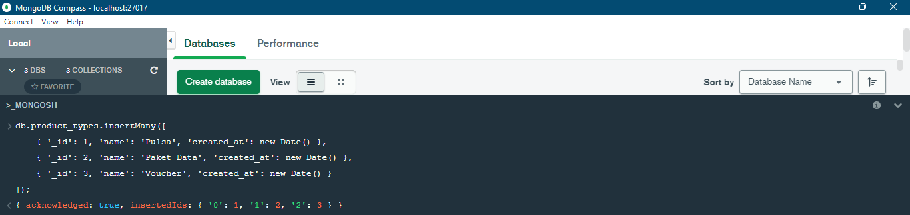

# (14) Introduction NoSQL and MongoDB

## Resume

Benefit Relational DB, yaitu dirancang untuk segala keperluan, (SQL) memiliki standar yang jelas, dan memiliki banyak tool(administrasi, reporting, framewrok).

* `Atomicity`, transaksi terjadi semua atau tidak sama sekali.
* `Consistency`, data tertulis merupakan data valid yang ditentukan berdasarkan aturan tertentu.
* `Isolation`, pada saat terjadi request secara bersamaan (concurent), memastikan bahwa transaksi dieksekusi seperti dijalankan secara sekuensial.
* `Durability`, jaminan bahwa transaksi yang telah tersimpan, tetap tersimpan.

`NoSQL (Not Only SQL)` adalah cara berpikir yang benar-benar baru tentang database dan bukanlah database relasional yang menghindari effort pada sifat transaksi ACID, kompleksitas SQL, design schema didepan, transactions ditangani oleh aplikasi. Berbeda dengan DBMS yang menyediakan mekanisme yang lebih fleksibel dibandingkan dengan model RDBMS (sifat ACID).

Kelebihan dari NoSQl:

* Schema less
* Fast Development
* Support big size file
* Support cluster

NoSQL digunakan pada saat:

* Membutuhkan skema fleksibel
* ACID tidak diperlukan
* Terdistribusi
* Data logging
* Data sementara

NoSQL tidak direkomendasikan untuk:

* Data finansial
* Data transaksi
* Business critical
* ACID - compliant

Kaidah CAP:

* `Consistency`, setiap proses baca mendapatkan data dari proses penulisan terakhir.
* `Availability`, Setiap request mendapatkan response yang bukan error.
* `Partition`, DBMS tetap dapat beroperasi meskipun ada kesalahan jaringan.

Schema less pada NoSQL yaitu :

* Tidak memiliki schema ketika menambahkan data.
* Aplikasi menangani proses validasi tipe data.
* Mendukung proses aggregasi dokumen pada item.

Beberapa kategori atau tipe NoSQL:

* Redis: Key/Value
* Cassandra: Column-family
* Neo4j: Graph
* MongoDB: Document-based

> Pada task akan menggunakan MongoDB. Untuk penggunan command atau query di MongoDB dapat di lihat pada task.

## Task

Database Preparation:

```js
use digital_outlet;

db.createCollection("operators");
db.createCollection("product_types");
db.createCollection("payment_methods");
db.createCollection("users");
db.createCollection("products");
db.createCollection("product_descriptions");
db.createCollection("transactions");
db.createCollection("transaction_details");
```

Output:


### Problem 1.1 - Create Data

#### A. Insert 5 operator

```js
db.operators.insertMany([
    { '_id': 1, 'name': 'Telkomsel', 'created_at': new Date() },
    { '_id': 2, 'name': 'Indosat', 'created_at': new Date() },
    { '_id': 3, 'name': 'XL', 'created_at': new Date() },
    { '_id': 4, 'name': 'AXIS', 'created_at': new Date() },
    { '_id': 5, 'name': 'Smartfren', 'created_at': new Date() }
]);
```

Output:


#### B. Insert 3 product type

```js
db.product_types.insertMany([
    { '_id': 1, 'name': 'Pulsa', 'created_at': new Date() },
    { '_id': 2, 'name': 'Paket Data', 'created_at': new Date() },
    { '_id': 3, 'name': 'Voucher', 'created_at': new Date() }
]);
```

Output:



#### Insert 8 product

```js
db.products.insertMany([
    // C. INSERT 2 PRODUCT DENGAN TYPE ID = 1, OPERATOR ID = 2
    { '_id': 1, 'product_type_id': 1, 'operator_id': 3, 'code': 'XLP10K', 'name': 'Pulsa XL Rp.10.000', 'status': 1, 'created_at': new Date() },
    { '_id': 2, 'product_type_id': 1, 'operator_id': 3, 'code': 'XLP20K', 'name': 'Pulsa XL Rp.20.000', 'status': 1, 'created_at': new Date() },

    // D. INSERT 3 PRODUCT DENGAN TYPE ID = 2, OPERATOR ID = 1
    { '_id': 3, 'product_type_id': 2, 'operator_id': 1, 'code': 'TSELD15', 'name': 'OMG! Ketengan 2.5 GB sampai 3.7 GB', 'status': 1, 'created_at': new Date() },
    { '_id': 4, 'product_type_id': 2, 'operator_id': 1, 'code': 'TSELN20', 'name': 'Disney+ Hotstar! Disney+ Hotstar 3 GB MAXStream', 'status': 1, 'created_at': new Date() },
    { '_id': 5, 'product_type_id': 2, 'operator_id': 1, 'code': 'TSELB15', 'name': 'ZOOM 1 hari 500Mb', 'status': 1, 'created_at': new Date() },

    // E. INSERT 3 PRODUCT DENGAN TYPE ID = 3, OPERATOR ID = 4
    { '_id': 6, 'product_type_id': 3, 'operator_id': 4, 'code': 'AXVP50K', 'name': 'Voucher Pulsa AXIS Rp.50.000', 'status': 1, 'created_at': new Date() },
    { '_id': 7, 'product_type_id': 3, 'operator_id': 4, 'code': 'AXVGML50K', 'name': 'Voucher Game AXIS! 170 Diamond MLBB', 'status': 1, 'created_at': new Date() },
    { '_id': 8, 'product_type_id': 3, 'operator_id': 4, 'code': 'AXVGPM75K', 'name': 'Voucher Game AXIS! 325 UC PUBGM', 'status': 1, 'created_at': new Date() }
]);
```

Output:


#### F. Insert deskripsi product pada setiap product

```js
db.product_descriptions.insertMany([
    { '_id': 1, 'description': 'Harga Rp.12.000, Perpanjangan masa aktif kartu XL anda 3 hari.', 'created_at': new Date() },
    { '_id': 2, 'description': 'Harga Rp.22.000, Perpanjangan masa aktif kartu XL anda 7 hari.', 'created_at': new Date() },
    { '_id': 3, 'description': 'Harga Rp.15.000, Kuota 2.5 GB hingga 3.7 GB OMG! KUOTA INTERNET SESUAI ZONA USER. Masa aktif 1 hari.', 'created_at': new Date() },
    { '_id': 4, 'description': 'Harga Rp.20.000, 3GB MAXStream selama 1 bulan. Sudah termasuk langganan Disney+ Hotstar 1 bulan.', 'created_at': new Date() },
    { '_id': 5, 'description': 'Harga Rp.15.000, Kuota Video Conference ZOOM 500Mb. Masa aktif 1 hari.', 'created_at': new Date() },
    { '_id': 6, 'description': 'Harga Rp.53.000, Voucher Pulsa AXIS Rp.50.000. Berlaku 1 kali.', 'created_at': new Date() },
    { '_id': 7, 'description': 'Harga Rp.50.000, Voucher Game AXIS! 170 Diamond Mobile Legends: Bang Bang. Berlaku untuk 1 akun.', 'created_at': new Date() },
    { '_id': 8, 'description': 'Harga Rp.75.000, Voucher Game AXIS! 325 UC PUBG Mobile. Berlaku untuk 1 akun.', 'created_at': new Date() }
]);
```

Output:


#### G. Insert 3 payment methods

```js
db.payment_methods.insertMany([
    { '_id': 1, 'name': 'Transfer Bank', 'status': 1, 'created_at': new Date() },
    { '_id': 2, 'name': 'Kartu Kredit/Debit', 'status': 1, 'created_at': new Date() },
    { '_id': 3, 'name': 'Dompet Digital', 'status': 1, 'created_at': new Date() }
]);
```

Output:


#### H. Insert 5 user

```js
db.users.insertMany([
    { '_id': 1, 'name': 'Imanuel', 'dob': new Date('2001-12-24'), 'gender': 'M', 'status': 1, 'created_at': new Date() },
    { '_id': 2, 'name': 'Tifanny', 'dob': new Date('2003-12-11'), 'gender': 'F', 'status': 1, 'created_at': new Date() },
    { '_id': 3, 'name': 'Yanuar', 'dob': new Date('2002-01-20'), 'gender': 'M', 'status': 1, 'created_at': new Date() },
    { '_id': 4, 'name': 'Grace', 'dob': new Date('2000-04-15'), 'gender': 'F', 'status': 1, 'created_at': new Date() },
    { '_id': 5, 'name': 'Elton', 'dob': new Date('2001-06-27'), 'gender': 'M', 'status': 1, 'created_at': new Date() }
]);
```

Output:


#### I. Insert 3 transaksi pada masing-masing user

```js
db.transactions.insertMany([
    { '_id': 1, 'user_id': 1, 'payment_method_id': 1, 'total_qty': 3, 'total_price': 49000, 'status': 'Proses', 'created_at': new Date() },
    { '_id': 2, 'user_id': 1, 'payment_method_id': 2, 'total_qty': 3, 'total_price': 57000, 'status': 'Batal', 'created_at': new Date() },
    { '_id': 3, 'user_id': 1, 'payment_method_id': 3, 'total_qty': 3, 'total_price': 50000, 'status': 'Sukses', 'created_at': new Date() },
    { '_id': 4, 'user_id': 2, 'payment_method_id': 1, 'total_qty': 3, 'total_price': 88000, 'status': 'Proses', 'created_at': new Date() },
    { '_id': 5, 'user_id': 2, 'payment_method_id': 2, 'total_qty': 3, 'total_price': 118000, 'status': 'Sukses', 'created_at': new Date() },
    { '_id': 6, 'user_id': 2, 'payment_method_id': 3, 'total_qty': 3, 'total_price': 178000, 'status': 'Sukses', 'created_at': new Date() },
    { '_id': 7, 'user_id': 3, 'payment_method_id': 1, 'total_qty': 3, 'total_price': 137000, 'status': 'Proses', 'created_at': new Date() },
    { '_id': 8, 'user_id': 3, 'payment_method_id': 2, 'total_qty': 3, 'total_price': 109000, 'status': 'Proses', 'created_at': new Date() },
    { '_id': 9, 'user_id': 3, 'payment_method_id': 3, 'total_qty': 3, 'total_price': 49000, 'status': 'Sukses', 'created_at': new Date() },
    { '_id': 10, 'user_id': 4, 'payment_method_id': 1, 'total_qty': 3, 'total_price': 57000, 'status': 'Sukses', 'created_at': new Date() },
    { '_id': 11, 'user_id': 4, 'payment_method_id': 2, 'total_qty': 3, 'total_price': 50000, 'status': 'Batal', 'created_at': new Date() },
    { '_id': 12, 'user_id': 4, 'payment_method_id': 3, 'total_qty': 3, 'total_price': 88000, 'status': 'Sukses', 'created_at': new Date() },
    { '_id': 13, 'user_id': 5, 'payment_method_id': 1, 'total_qty': 3, 'total_price': 118000, 'status': 'Sukses', 'created_at': new Date() },
    { '_id': 14, 'user_id': 5, 'payment_method_id': 2, 'total_qty': 3, 'total_price': 178000, 'status': 'Sukses', 'created_at': new Date() },
    { '_id': 15, 'user_id': 5, 'payment_method_id': 3, 'total_qty': 3, 'total_price': 137000, 'status': 'Sukses', 'created_at': new Date() }
]);
```

Output:


#### J. Insert 3 product pada masing-masing transaksi

```js
db.transaction_details.insertMany([
    { '_id': 1, 'transaction_id': 1, 'product_id': 1, 'qty': 1, 'price': 12000, 'status': 'Proses', 'created_at': new Date() },
    { '_id': 2, 'transaction_id': 1, 'product_id': 2, 'qty': 1, 'price': 22000, 'status': 'Proses', 'created_at': new Date() },
    { '_id': 3, 'transaction_id': 1, 'product_id': 3, 'qty': 1, 'price': 15000, 'status': 'Proses', 'created_at': new Date() },
    { '_id': 4, 'transaction_id': 2, 'product_id': 2, 'qty': 1, 'price': 22000, 'status': 'Batal', 'created_at': new Date() },
    { '_id': 5, 'transaction_id': 2, 'product_id': 3, 'qty': 1, 'price': 15000, 'status': 'Batal', 'created_at': new Date() },
    { '_id': 6, 'transaction_id': 2, 'product_id': 4, 'qty': 1, 'price': 20000, 'status': 'Batal', 'created_at': new Date() },
    { '_id': 7, 'transaction_id': 3, 'product_id': 3, 'qty': 1, 'price': 15000, 'status': 'Sukses', 'created_at': new Date() },
    { '_id': 8, 'transaction_id': 3, 'product_id': 4, 'qty': 1, 'price': 20000, 'status': 'Sukses', 'created_at': new Date() },
    { '_id': 9, 'transaction_id': 3, 'product_id': 5, 'qty': 1, 'price': 15000, 'status': 'Sukses', 'created_at': new Date() },
    { '_id': 10, 'transaction_id': 4, 'product_id': 4, 'qty': 1, 'price': 20000, 'status': 'Proses', 'created_at': new Date() },
    { '_id': 11, 'transaction_id': 4, 'product_id': 5, 'qty': 1, 'price': 15000, 'status': 'Proses', 'created_at': new Date() },
    { '_id': 12, 'transaction_id': 4, 'product_id': 6, 'qty': 1, 'price': 53000, 'status': 'Proses', 'created_at': new Date() },
    { '_id': 13, 'transaction_id': 5, 'product_id': 5, 'qty': 1, 'price': 15000, 'status': 'Sukses', 'created_at': new Date() },
    { '_id': 14, 'transaction_id': 5, 'product_id': 6, 'qty': 1, 'price': 53000, 'status': 'Sukses', 'created_at': new Date() },
    { '_id': 15, 'transaction_id': 5, 'product_id': 7, 'qty': 1, 'price': 50000, 'status': 'Sukses', 'created_at': new Date() },
    { '_id': 16, 'transaction_id': 6, 'product_id': 6, 'qty': 1, 'price': 53000, 'status': 'Sukses', 'created_at': new Date() },
    { '_id': 17, 'transaction_id': 6, 'product_id': 7, 'qty': 1, 'price': 50000, 'status': 'Sukses', 'created_at': new Date() },
    { '_id': 18, 'transaction_id': 6, 'product_id': 8, 'qty': 1, 'price': 75000, 'status': 'Sukses', 'created_at': new Date() },
    { '_id': 19, 'transaction_id': 7, 'product_id': 7, 'qty': 1, 'price': 50000, 'status': 'Proses', 'created_at': new Date() },
    { '_id': 20, 'transaction_id': 7, 'product_id': 8, 'qty': 1, 'price': 75000, 'status': 'Proses', 'created_at': new Date() },
    { '_id': 21, 'transaction_id': 7, 'product_id': 1, 'qty': 1, 'price': 12000, 'status': 'Proses', 'created_at': new Date() },
    { '_id': 22, 'transaction_id': 8, 'product_id': 8, 'qty': 1, 'price': 75000, 'status': 'Proses', 'created_at': new Date() },
    { '_id': 23, 'transaction_id': 8, 'product_id': 1, 'qty': 1, 'price': 12000, 'status': 'Proses', 'created_at': new Date() },
    { '_id': 24, 'transaction_id': 8, 'product_id': 2, 'qty': 1, 'price': 22000, 'status': 'Proses', 'created_at': new Date() },
    { '_id': 25, 'transaction_id': 9, 'product_id': 1, 'qty': 1, 'price': 12000, 'status': 'Sukses', 'created_at': new Date() },
    { '_id': 26, 'transaction_id': 9, 'product_id': 2, 'qty': 1, 'price': 22000, 'status': 'Sukses', 'created_at': new Date() },
    { '_id': 27, 'transaction_id': 9, 'product_id': 3, 'qty': 1, 'price': 15000, 'status': 'Sukses', 'created_at': new Date() },
    { '_id': 28, 'transaction_id': 10, 'product_id': 2, 'qty': 1, 'price': 22000, 'status': 'Sukses', 'created_at': new Date() },
    { '_id': 29, 'transaction_id': 10, 'product_id': 3, 'qty': 1, 'price': 15000, 'status': 'Sukses', 'created_at': new Date() },
    { '_id': 30, 'transaction_id': 10, 'product_id': 4, 'qty': 1, 'price': 20000, 'status': 'Sukses', 'created_at': new Date() },
    { '_id': 31, 'transaction_id': 11, 'product_id': 3, 'qty': 1, 'price': 15000, 'status': 'Batal', 'created_at': new Date() },
    { '_id': 32, 'transaction_id': 11, 'product_id': 4, 'qty': 1, 'price': 20000, 'status': 'Batal', 'created_at': new Date() },
    { '_id': 33, 'transaction_id': 11, 'product_id': 5, 'qty': 1, 'price': 15000, 'status': 'Batal', 'created_at': new Date() },
    { '_id': 34, 'transaction_id': 12, 'product_id': 4, 'qty': 1, 'price': 20000, 'status': 'Sukses', 'created_at': new Date() },
    { '_id': 35, 'transaction_id': 12, 'product_id': 5, 'qty': 1, 'price': 15000, 'status': 'Sukses', 'created_at': new Date() },
    { '_id': 36, 'transaction_id': 12, 'product_id': 6, 'qty': 1, 'price': 53000, 'status': 'Sukses', 'created_at': new Date() },
    { '_id': 37, 'transaction_id': 13, 'product_id': 5, 'qty': 1, 'price': 15000, 'status': 'Sukses', 'created_at': new Date() },
    { '_id': 38, 'transaction_id': 13, 'product_id': 6, 'qty': 1, 'price': 53000, 'status': 'Sukses', 'created_at': new Date() },
    { '_id': 39, 'transaction_id': 13, 'product_id': 7, 'qty': 1, 'price': 50000, 'status': 'Sukses', 'created_at': new Date() },
    { '_id': 40, 'transaction_id': 14, 'product_id': 6, 'qty': 1, 'price': 53000, 'status': 'Sukses', 'created_at': new Date() },
    { '_id': 41, 'transaction_id': 14, 'product_id': 7, 'qty': 1, 'price': 50000, 'status': 'Sukses', 'created_at': new Date() },
    { '_id': 42, 'transaction_id': 14, 'product_id': 8, 'qty': 1, 'price': 75000, 'status': 'Sukses', 'created_at': new Date() },
    { '_id': 43, 'transaction_id': 15, 'product_id': 7, 'qty': 1, 'price': 50000, 'status': 'Sukses', 'created_at': new Date() },
    { '_id': 44, 'transaction_id': 15, 'product_id': 8, 'qty': 1, 'price': 75000, 'status': 'Sukses', 'created_at': new Date() },
    { '_id': 45, 'transaction_id': 15, 'product_id': 1, 'qty': 1, 'price': 12000, 'status': 'Sukses', 'created_at': new Date() }
]);
```

Output:


### Problem 1.2 - Read Data

#### A. User dengan `gender` laki-laki

```js
db.users.find({ gender: 'M' });
```

Output:


#### B. Product dengan `id` 3

```js
db.products.findOne({ _id: 3 });
```

Output:


#### C. Jumlah pelanggan bergender perempuan

```js
db.users.find({ gender: 'F' }).count();
```

Output:


#### D. Urutan nama pelanggan sesuai abjad

```js
db.users.find().sort({ name: 1 })
```

Output:


#### E. Menampilkan 5 data product

```js
db.products.find().limit(5);
```

Output:


### Problem 1.3 - Udate Data

#### A. Update data product dengan `id` 1

```js
db.products.updateOne(
    { _id: 1 },
    {
        $set: {
            name: "product dummy",
            updated_at: new Date()
        }
    }
);
```

Output:


#### B. Update data detail transaksi dengan `product_id` 1

```js
db.transaction_details.updateMany(
    { product_id: 1 },
    {
        $set: {
            qty: 3,
            updated_at: new Date()
        }
    }
);
```

Output:


### Problem 1.4 - Delete Data

#### A. Hapus data product dengan `id` 1

```js
db.products.deleteOne({ _id: 1 });
```

#### B. Hapus data product dengan `product_type_id` 1

```js
db.products.deleteMany({ product_type_id: 1 });
```

Output:


