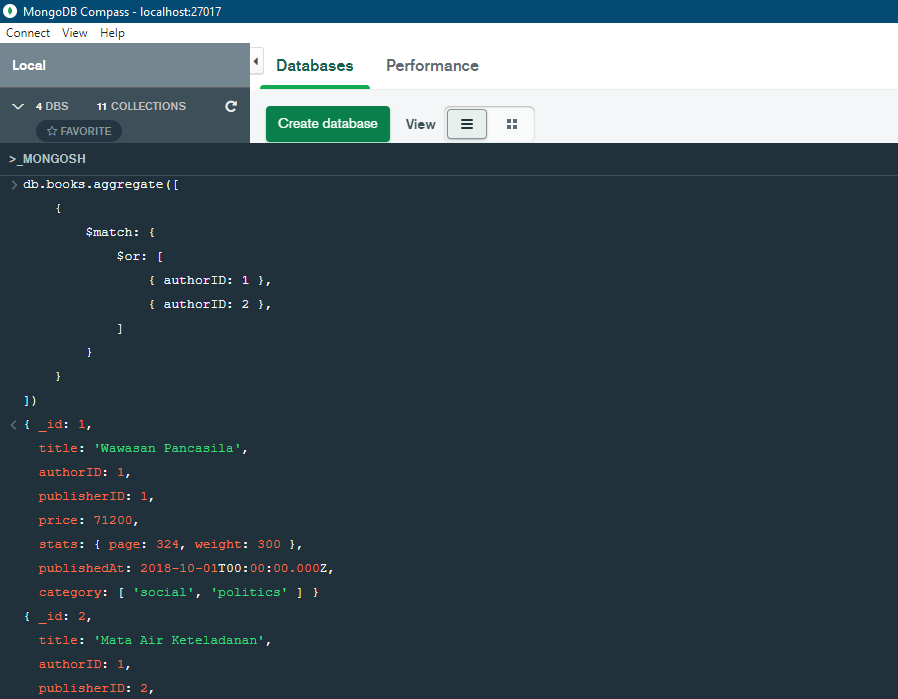
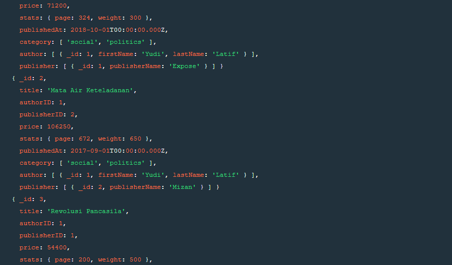

# (16) MongoDB - Advanced Query - Array - Aggregation

## Resume

### Comparison Operators

| Operator | Keterangan |
| :------: | :-------- |
| `$eq`      | (`==` atau `equal`) Digunakan untuk mencocokkan nilai yang sama dengan nilai yang ditentukan. |
| `$ne`      | (`!=` atau `not equal`) Digunakan untuk mencocokkan semua nilai yang tidak sama dengan nilai yang ditentukan. |
| `$gt`      | (`>` atau `greater than`) Digunakan untuk mencocokkan nilai yang lebih besar dari nilai yang ditentukan. |
| `$gte`     | (`>=` atau `greater than equal`) Digunakan untuk mencocokkan nilai yang lebih besar dari sama dengan nilai yang ditentukan. |
| `$lt`      | (`<` atau `less than`) Digunakan untuk mencocokkan nilai yang kurang dari nilai yang ditentukan. |
| `$lte`     | (`<=` atau `less than equal`) Digunakan untuk mencocokkan nilai yang kurang dari sama dengan nilai yang ditentukan. |
| `$in`      | Digunakan untuk mencocokkan salah satu nilai yang ditentukan dalam array. |
| `$nin`     | Digunakan untuk mencocokkan tidak ada nilai yang ditentukan dalam array. |

### Logical Operators

| Operator | Keterangan |
| :------: | :-------- |
| `$and`     | Digunakan untuk menggabungkan klausa kueri dengan logika AND dan mengembalikan semua dokumen yang cocok dengan kondisi yang diberikan dari kedua klausa. |
| `$or`      | Digunakan untuk menggabungkan klausa kueri dengan logika OR dan mengembalikan semua dokumen yang cocok dengan kondisi yang diberikan dari salah satu klausa. |
| `$not`     | Digunakan untuk membalikkan efek ekspresi kueri dan mengembalikan dokumen yang tidak cocok dengan ekspresi kueri. |
| `$nor`     | Digunakan untuk menggabungkan klausa kueri dengan logika NOR dan mengembalikan semua dokumen yang tidak cocok dengan kedua klausa. |

### Aggregation pipeline

Stages:

* `$match`: Digunakan untuk memfilter dokumen yang dapat mengurangi jumlah dokumen yang diberikan sebagai input ke tahap selanjutnya.
* `$project`: Digunakan untuk memilih beberapa bidang tertentu dari koleksi.
* `$lookup`: Digunakan untuk menggabungkan dokumen dari satu koleksi ke dokumen koleksi lain dari database yang sama berdasarkan beberapa kueri.
* `$group`: Digunakan untuk mengelompokkan dokumen berdasarkan beberapa nilai.
* `$sort`: Digunakan untuk mengurutkan dokumen yang menyusunnya kembali.
* `$skip`: Digunakan untuk melewati n jumlah dokumen dan melewati sisa dokumen.
* `$limit`: Digunakan untuk melewati n jumlah dokumen pertama sehingga membatasinya.
* `$unwind`: Digunakan untuk dokumen yang menggunakan array yaitu mendekonstruksi array dalam dokumen untuk mengembalikan dokumen untuk setiap elemen.
* `$out`: Digunakan untuk menulis dokumen yang dihasilkan ke koleksi baru.

Accumulators:

* `$sum`: Digunakan untuk menjumlahkan nilai numerik untuk dokumen di setiap grup.
* `$count`: Digunakan untuk menghitung jumlah total dokumen.
* `$avg`: Digunakan untuk menghitung rata-rata semua nilai yang diberikan dari semua dokumen.
* `$min`: Digunakan untuk mendapat nilai minimum dari semua dokumen
* `$max`: Digunakan untuk mendapat nilai maksimum dari semua dokumen.
* `$first`: Digunakan untuk mendapat dokumen pertama dari pengelompokan.
* `$last`: Digunakan untuk mendapat dokumen terakhir dari pengelompokan.

> Untuk implementasi query Comparison Operators, Logical Operators dan Aggregation pipeline, dapat dilihat pada task dibawah.

## Task

> Untuk keseluruhan source code, bisa klik di link berikut: [book_store.mongodb](praktikum/book_store.mongodb)

### Database Preparation

#### Membuat dan menggunakan database `book_store`

```js
use('book_store');
```

#### Menambahkan data pada tabel `books`

```js
db.books.insertMany([
    {
        '_id': 1,
        'title': 'Wawasan Pancasila',
        'authorID': 1,
        'publisherID': 1,
        'price': 71200,
        'stats': {
            'page': 324,
            'weight': 300
        },
        'publishedAt': new Date('2018-10-01'),
        'category': [
            'social',
            'politics'
        ]
    },
    {
        '_id': 2,
        'title': 'Mata Air Keteladanan',
        'authorID': 1,
        'publisherID': 2,
        'price': 106250,
        'stats': {
            'page': 672,
            'weight': 650
        },
        'publishedAt': new Date('2017-09-01'),
        'category': [
            'social',
            'politics'
        ]
    },
    {
        '_id': 3,
        'title': 'Revolusi Pancasila',
        'authorID': 1,
        'publisherID': 1,
        'price': 54400,
        'stats': {
            'page': 200,
            'weight': 500
        },
        'publishedAt': new Date('2015-05-01'),
        'category': [
            'social',
            'politics'
        ]
    },
    {
        '_id': 4,
        'title': 'Self Driving',
        'authorID': 2,
        'publisherID': 1,
        'price': 58650,
        'stats': {
            'page': 286,
            'weight': 300
        },
        'publishedAt': new Date('2018-05-01'),
        'category': [
            'self-development'
        ]
    },
    {
        '_id': 5,
        'title': 'Self Disruption',
        'authorID': 2,
        'publisherID': 2,
        'price': 83300,
        'stats': {
            'page': 400,
            'weight': 800
        },
        'publishedAt': new Date('2018-05-01'),
        'category': [
            'self-development'
        ]
    }
]);
```

Output:


#### Menambahkan data pada tabel `authors`

```js
db.authors.insertMany([
    { '_id': 1, 'firstName': 'Yudi', 'lastName': 'Latif' },
    { '_id': 2, 'firstName': 'Rhenald', 'lastName': 'Kasali' }
]);
```

Output:


#### Menambahkan data pada tabel `publishers`

```js
db.publishers.insertMany([
    { '_id': 1, 'publisherName': 'Expose' },
    { '_id': 2, 'publisherName': 'Mizan' }
]);
```

Output:


### Problem 1 - Menampilkan data buku dari `authorID` 1 dan 2

```js
db.books.aggregate([
    {
        $match: {
            $or: [
                { authorID: 1 },
                { authorID: 2 },
            ]
        }
    }
])
```

Output:




### Problem 2 - Menampilkan data buku dan harganya dengan `authorID` 1

```js
db.books.aggregate([
    { $match: { authorID: 1 } },
    {
        $project: {
            _id: 1,
            title: 1,
            price: 1
        }
    }
]);
```

Output:


### Problem 3 - Menampilkan total jumlah halaman buku dengan `authorID` 2

```js
db.books.aggregate([
    { $match: { authorID: 2 } },
    {
        $group: {
            _id: '$authorID',
            totalPages: {
                $sum: '$stats.page'
            }
        }
    }
]);
```

Output:


### Problem 4 - Menampilkan semua field `books` dan `authors` terkait

#### Cara 1

```js
db.authors.aggregate([
    {
        $lookup: {
            from: 'books',
            localField: '_id',
            foreignField: 'authorID',
            as: 'books'
        }
    }
]);
```

Output:


#### Cara 2

```js
db.books.aggregate([
    {
        $lookup: {
            from: 'authors',
            localField: 'authorID',
            foreignField: '_id',
            as: 'authors'
        }
    }
]);
```

Output:


### Problem 5 - Menampilkan semua field `books`, `authors` dan `publishers` terkait

```js
db.books.aggregate([
    {
        $lookup: {
            from: 'authors',
            localField: 'authorID',
            foreignField: '_id',
            as: 'author'
        }
    },
    {
        $lookup: {
            from: 'publishers',
            localField: 'publisherID',
            foreignField: '_id',
            as: 'publisher'
        }
    }
]);
```

Output:





### Problem 6 - Menampilkan summary data `authors`, `books` dan `publishers`

```js
db.books.aggregate([
    {
        $lookup: {
            from: 'authors',
            localField: 'authorID',
            foreignField: '_id',
            as: 'author'
        }
    },
    {
        $lookup: {
            from: 'publishers',
            localField: 'publisherID',
            foreignField: '_id',
            as: 'publisher'
        }
    },
    { $unwind: '$author' },
    { $unwind: '$publisher' },
    {
        $group: {
            _id: { $concat: ['$author.firstName', ' ', '$author.lastName'] },
            number_of_books: { $sum:1 },
            list_of_book: { $push : { $concat: ['$title', ' (', '$publisher.publisherName', ')'] }}
        }
    },
]);
```

Output:


### Problem 7 - Memberikan diskon untuk setiap buku berdasarkan harga buku

```js
db.books.aggregate([
    {
        $project: {
            _id: 1,
            title: 1,
            price: 1,
            promo: {
                $switch: {
                    branches: [
                        { case: { $lt: [ '$price', 60000 ] }, then: '1%' },
                        { case: { $and: [
                            { $gt: [ '$price', 100 ] },
                            { $lt: [ '$price', 90000 ] }
                        ]}, then: '2%'},
                        { case: { $gt: [ '$price', 90000 ] }, then: '3%' },
                    ],
                    default: '0%'
                }
            }
        }
    },
]);
```

Output:


### Problem 8 - Menampilkan semua nama buku, harga, nama author dan publisher, serta mengurutkan harganya dari yang termahal ke termurah

```js
db.books.aggregate([
    {
        $lookup: {
            from: 'authors',
            localField: 'authorID',
            foreignField: '_id',
            as: 'author'
        }
    },
    {
        $lookup: {
            from: 'publishers',
            localField: 'publisherID',
            foreignField: '_id',
            as: 'publisher'
        }
    },
    { $unwind: '$author' },
    { $unwind: '$publisher' },
    {
        $project: {
            title: 1,
            price: 1,
            author: {
                $concat: ['$author.firstName', ' ', '$author.lastName']
            },
            publisher: '$publisher.publisherName'
        }
    },
    {
        $sort: {
            price: -1
        }
    }
]);
```

Output:


### Problem 9 - Menampilkan semua nama buku, harga dan publisher, kemudian tampilkan hanya data 3 dan 4

```js
db.books.aggregate([
    {
        $unionWith: {
            coll: 'books',
            pipeline: [{
                $match: {
                    $or: [
                        {_id: 3},
                        {_id: 4},
                    ]
                }
            }]
        }
    },
    {
        $lookup: {
            from: 'publishers',
            localField: 'publisherID',
            foreignField: '_id',
            as: 'publisher'
        }
    },
    { $unwind: '$publisher' },
    {
        $project: {
            title: 1,
            price: 1,
            publisher: '$publisher.publisherName'
        }
    }
]);
```

Output:


