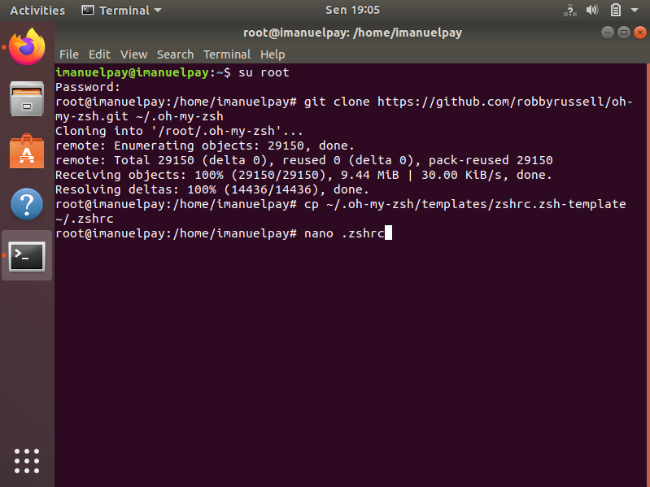

# (17) Configuration Management and CLI

## Resume

User Interface adalah istilah yang digunakan untuk menentukan bagaimana pengguna berinteraksi dengan perangkat elektronik, khususnya komputer, jenis-jenis User Interface seperti `CLI` dan `GUI`. `CLI (Command Line Interface)` adalah Interface atau antarmuka berbasis teks yang digunakan untuk berinteraksi dengan perangkat lunak dan sistem operasi dengan mengetikkan perintah ke dalam antarmuka dan menerima respons dengan cara yang sama. Sedangkan `GUI (Graphic User Interface)` adalah jenis antarmuka pengguna yang menggunakan metode interaksi pada peranti elektronik secara grafis (bukan perintah teks) antara pengguna dan komputer.

Kelebihan CLI:

* Performa lebih tinggi
* Lebih efektif dan efisien dalam penggunaan
* Hanya membutukan spesifikasi hardware yang rendah
* Hanya membutuhkan Memori yang kecil karena berupa teks saja
* Kemampuan untuk menyimpan skrip untuk mengotomatisasi tugas-tugas berulang
* Membari informasi untuk membantu mengatasi masalah

Beberapa perintah dasar CLI:

* `ls`, untuk melihat konten atau isi direktori.
* `cd`, untuk berpindah ke direktori.
* `pwd`, untuk mencari path dari direktori (folder) yang Anda gunakan saat ini.
* `mkdir`, untuk membuat direktori baru.
* `rmdir`, untuk menghapus direktori.
* `touch`, membuat file baru yang kosong.
* `rm`, untuk menghapus file atau direktori beserta isinya.
* `cp`, untuk menyalin file dari direktori saat ini ke direktori yang berbeda.
* `mv`, untuk memindahkan file meskipun sebenarnya bisa digunakan untuk mengganti atau mengubah nama file.
* `sudo`, singkatan dari “SuperUser Do” dan berfungsi untuk menjalankan task yang memerlukan hak akses (permission) administrative atau root.
* `man` & `-help`, digunakan untuk tahu lebih banyak tentang command-command Linux dan bagaimana cara menggunakannya.
* `nano` & `vi`,  text editor yang terinstall.
* `ping`,untuk mengecek status konektivitas ke server.
* `ln`, untuk membuat tautan antar file.
* `cat`, untuk membuat daftar konten atau isi file pada standard output (sdout).
* `chmod`, digunakan untuk membaca, menulis, dan menjalankan permission (hak akses) file dan direktori.
* `chown`, untuk mengubah atau mentransfer kepemilikan file ke username khusus atau yang spesifik.
* `diff`, membandingkan konten atau isi dua file berdasarkan baris demi baris.
* `wget`, mengunduh file dari internet.
* `uname`, digunakan untuk mencetak informasi lengkap mengenai sistem Linux, misalnya nama mesin, sistem operasi, kernel, dan lain-lain.
* `echo`, untuk memindahkan beberapa data ke dalam satu file atau pint data ke layar.

## Task

### Problem 1 - Install oh-my-zsh

* Perbaharui dahulu paket-paket di Ubuntu

  ```bash
  sudo apt-get update
  sudo apt upgrade
  ```

* Instal paket prasyarat, yaitu ZSH, powerline & powerline fonts

  ```bash
  sudo apt install zsh
  sudo apt-get install powerline fonts-powerline
  ```

  
  

* Clone Oh My Zsh dari repositori github, Membuat file konfigurasi ZSH baru, Siapkan tema `Fancy` untuk `Terminal` Anda - Buka file `.zshrc` menggunakan editor `nano`, dan cari baris `ZSH_THEME="robbyrussell"` kemudian ganti `robbyrussell` dengan `agnoster` tema di file `.zshrc`

  ```bash
  sudo apt-get install git
  git clone https://github.com/robbyrussell/oh-my-zsh.git ~/.oh-my-zsh
  cp ~/.oh-my-zsh/templates/zshrc.zsh-template ~/.zshrc
  nano .zshrc
  ```

  
  
  

* Ubah Shell Default dan Perbarui Instalasi oh-my-zsh, install ZSH Syntax Highlighting untuk Oh My Zsh

  ```bash
  chsh -s /bin/zsh
  cd .oh-my-zsh
  upgrade_oh_my_zsh
  git clone https://github.com/zsh-users/zsh-syntax-highlighting.git "$HOME/.zsh-syntax-highlighting" --depth 1
  echo "source $HOME/.zsh-syntax-highlighting/zsh-syntax-highlighting.zsh" >> "$HOME/.zshrc"
  chsh -s /bin/bash
  ```

  
  
  

### Problem 2 - Create Automation Script

Automation Script:

```bash
#!/bin/bash

name_dir="$1 at $(date)"
mkdir "$name_dir"
cd "$name_dir"

mkdir about_me
mkdir about_me/personal
echo "https://www.facebook.com/$2" > about_me/personal/facebook.txt

mkdir about_me/professional
echo "https://www.linkedin.com/in/$3" > about_me/professional/linkedin.txt

mkdir my_system_info
echo "My username: $USER" > my_system_info/about_this_laptop.txt
echo "With host: $(uname -a)" >> my_system_info/about_this_laptop.txt

echo "Connection to google:" > my_system_info/internet_connection.txt
echo "$(ping forcesafesearch.google.com -c 3)" >> my_system_info/internet_connection.txt

mkdir my_friends
echo "1) Achmad Miftahul - amulum" > my_friends/list_of_my_friends.txt
echo "2) Achmad Rafiq - achmadrafiq97" >> my_friends/list_of_my_friends.txt
echo "3) Adiststi - adiststi" >> my_friends/list_of_my_friends.txt
echo "4) Agung - agungajin19" >> my_friends/list_of_my_friends.txt
echo "5) Azzahra - al7262" >> my_friends/list_of_my_friends.txt
echo "6) Charisma - fadzrichar" >> my_friends/list_of_my_friends.txt
echo "7) Farida - ulfarida" >> my_friends/list_of_my_friends.txt
echo "8) Garry - garryarielcussoy" >> my_friends/list_of_my_friends.txt
echo "9) Hamdi - hamdiranu" >> my_friends/list_of_my_friends.txt
echo "10) Hedy Gading - Gading09" >> my_friends/list_of_my_friends.txt
echo "11) Ilham - aamfatur" >> my_friends/list_of_my_friends.txt
echo "12) Lelianto - Lelianto">>  my_friends/list_of_my_friends.txt
echo "13) Mohammad - daffa99" >> my_friends/list_of_my_friends.txt
echo "14) Muhammad Fadhil - fabdulkarim" >> my_friends/list_of_my_friends.txt
echo "15) Ofbimon - bimon-alta" >> my_friends/list_of_my_friends.txt
echo "16) Purnama Syafitri - pipitmnr" >> my_friends/list_of_my_friends.txt
echo "17) Setyo - setyoyo07" >> my_friends/list_of_my_friends.txt
echo "18) Wildan - wiflash" >> my_friends/list_of_my_friends.txt
echo "19) Willy - sumarnowilly94" >> my_friends/list_of_my_friends.txt
echo "20) Woka - woka20" >> my_friends/list_of_my_friends.txt
```

Output:


> Untuk melihat isi file hasil eksekusi Automation Script, dapat membuka folder `praktikum/imanuel at Tue Mar 15 11:54:56 WITA 2022`
