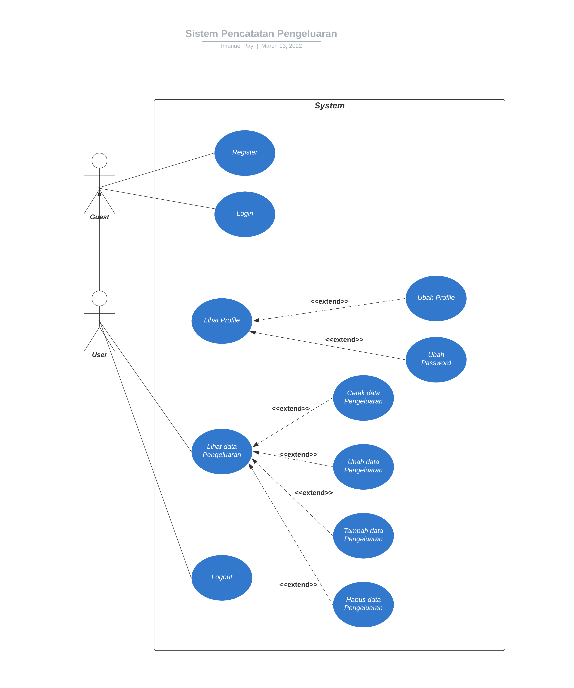
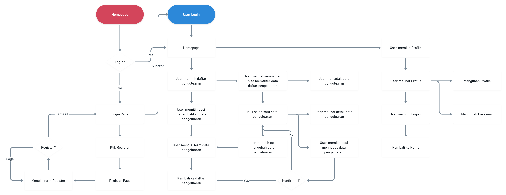

# (18) System Design

## Resume

`Diagram` adalah representasi simbolis dari informasi menggunakan teknik visualisasi. Beberapa tools Diagram Design seperti `smartdraw`, `Lucidchart`, `Whimsical`, `dram.io`, dan `Microsoft Visio`. Desain software yang umum digunakan, seperti `Flowchart`, `Use Case Diagram`, `ERD`, `HLA`.

`Vertical scaling` adalah upaya untuk meningkatkan kapabilitias dari single server seperti menambah RAM dan lain sebagainya. `Horizontal scaling` adalah upaya untuk meningkatkan kapabilitas dari multiple server dimana masing2 dari server tersebut tidak memiliki banyak perubahan dari segi spesifikasi.

Sistem terdistribusi adalah sekumpulan prosesor yang tidak saling berbagi memori atau clock dan terhubung melalui jaringan komunikasi yang bervariasi dan dilengkapi dengan sistem software tedistribusi untuk membentuk fasilitas komputer terintegrasi. Beberapa karakteristik dari Distributed Systems, yaitu `Scalability`, `Reliability`, `Availability`, `Efficiency`, `Serviceability or Manageability`.

`Job/Work Queue`, dalam perangkat lunak sistem , antrian pekerjaan (kadang-kadang antrian batch ), adalah struktur data yang dikelola oleh perangkat lunak penjadwal pekerjaan yang berisi pekerjaan untuk dijalankan.

`Load balancing` adalah proses pembagian beban traffic sebuah aplikasi atau server. Dengan load balancer, beban traffic tidak akan dibebankan kepada beberapa jalur koneksi. Hal ini mempercepat waktu respons server Anda dan mencegahnya dari overloading. Dengan begini, kinerja server Anda akan lebih maksimal tidak peduli berapa banyak traffic yang Anda dapatkan.

`Monolithic` merupakan sebuah arsitektur dalam pembuatan aplikasi dimana semua komponen menjadi satu kesatuan. Setiap `Microservices` merupakan aplikasi kecil yang memiliki arsitektur heksagonal sendiri yang terdiri dari logika beserta berbagai adapternya (bahasa pemrograman, dan lain-lain).

`Caching` adalah proses menyimpan data sementara, dimana browser, situs, atau aplikasi tidak perlu untuk mengunduh data secara berulang atau terus – menerus.

`Database Redundancy` adalah duplikasi atau penyimpanan data yang sama secara berulang dalam beberapa file, sehingga data yang sama di simpan di dalam lebih dari 1 lokasi. `Database Replication` adalah seperangkat teknologi yang digunakan untuk menyalin dan mendistribusikan data dari satu database ke database yang lain dan mensinkronisasikan antar database untuk menjaga konsistensi. Dengan replikasi, data dapat didistribusikan ke lokasi yang berbeda dan pengguna yang jauh

## Task

### Problem 1 - Query

SQL:

```sql
SELECT * FROM users;
```

Redis:

```js
SCAN users
```

Neo4j:

```js
MATCH (user:Users) RETURN user
```

Cassandra:

```sql
SELECT * FROM Alta.Users;
```

### Problem 2 - Diagram

Diagram sistem yang dapat digunakan untuk mencatat pengeluaran seseorang dalam jangka waktu harian.

#### Use Case Diagram

Link Diagram:
[https://lucid.app/imanuelpay/sistem-pencatatan-pengeluaran](https://lucid.app/lucidchart/62a467c0-e170-4258-8d0d-667c506c33fd/edit?viewport_loc=-1046%2C-932%2C3630%2C1671%2C.Q4MUjXso07N&invitationId=inv_06289941-3d45-4b16-b715-6801b236ee40)

Gambar Diagram:



#### Flowchart

Link Flowchart:
[https://whimsical.com/imanuelpay/sistem-pencatatan-pengeluaran](https://whimsical.com/sistem-pencatatan-pengeluaran-82yr5rJZCFug27KgH9fBUZ)

Gambar Flowchart:


