# (19) Intro RESTful API

## Resume

`API` adalah singkatan dari `Application Programming Interface`. API sendiri merupakan interface yang dapat menghubungkan satu aplikasi dengan aplikasi lainnya. Dengan kata lain, peran API adalah sebagai perantara antar berbagai aplikasi berbeda, baik dalam satu platform yang sama atau pun lintas platform.

`REST`, singkatan bahasa Inggris dari `REpresentational State Transfer` atau transfer keadaan representasi, adalah suatu gaya arsitektur perangkat lunak untuk untuk pendistribusian sistem hipermedia seperti WWW. Sedangkan `RESTful` merupakan sebutan untuk web services yang menerapkan arsitektur REST.

`JSON`, singkatan dari JavaScript Object Notation, adalah suatu format ringkas pertukaran data komputer. Formatnya berbasis teks dan terbaca-manusia serta digunakan untuk merepresentasikan struktur data sederhana dan larik asosiatif.

Beberapa HTTP Method yang umum digunakan:

- GET
- POST
- PUT
- HEAD
- DELETE
- PATCH
- OPTIONS

Untuk HTTP Response Code dapat di lihat [disini](https://id.wikipedia.org/wiki/Daftar_kode_status_HTTP)

## Task

### Problem - Postman

File export collection postman [export_collection.json](praktikum/export_collection.json)

Mengatur Environment:
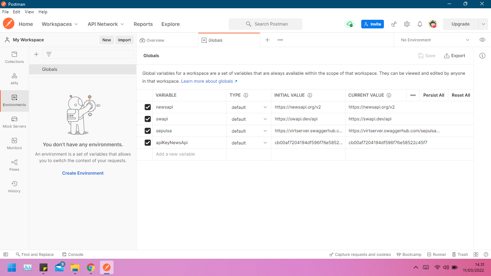

#### A. Target API 1

- Base URL = `https://newsapi.org/v2`
- Header :
  - Content-Type: application/json
  - Authorization: {api.key}

\
**Everything**

Method : GET

- Endpoint : `/everything?q=minyak goreng`
  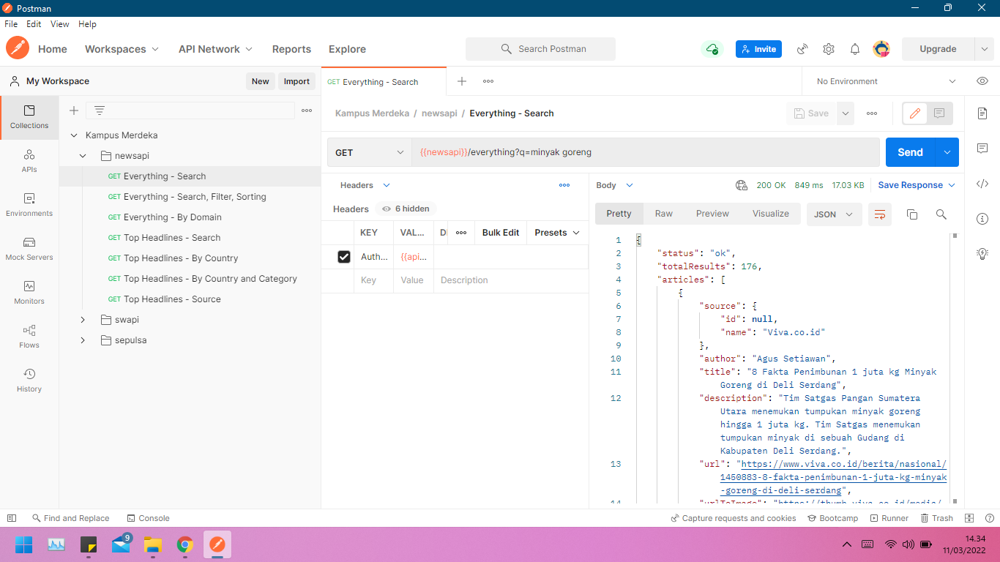
- Endpoint : `/everything?q=rusia&from=2022-03-10&to=2022-03-10&sortBy=popularity&language=id`
  
- Endpoint : `/everything?domains=detik.com,kompas.com`
  

\
**Top Headlines**

Method : GET

- Endpoint : `/top-headlines?q=ura`
  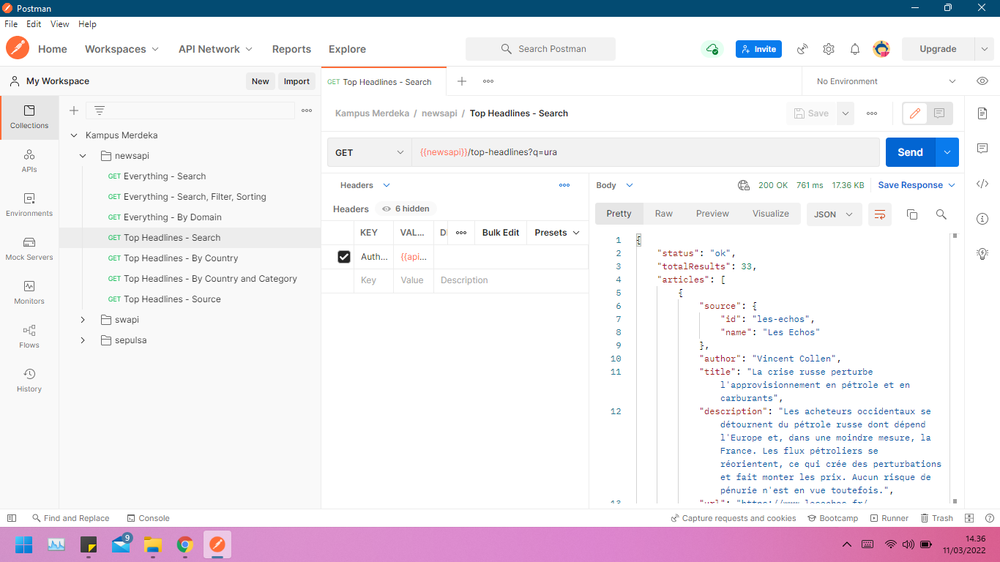
- Endpoint : `/top-headlines?country=id`
  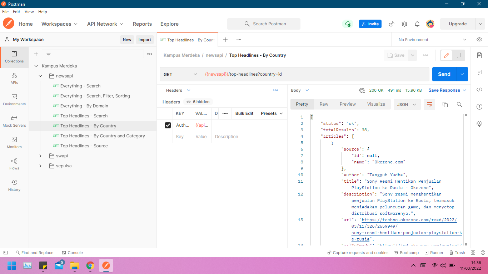
- Endpoint : `/top-headlines?country=id&category=business`
  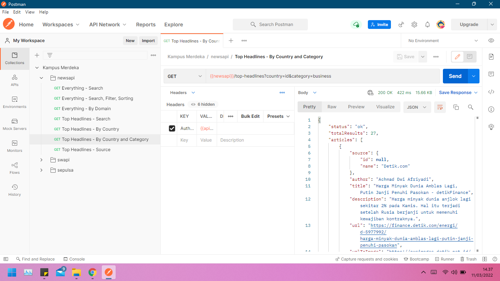
- Endpoint : `/top-headlines?sources=cnn`
  

#### B. Target API 2

- Base URL = `https://swapi.dev/api`
- Header :
  - Content-Type: application/json
- Method : GET
- Endpoint : `/people`
  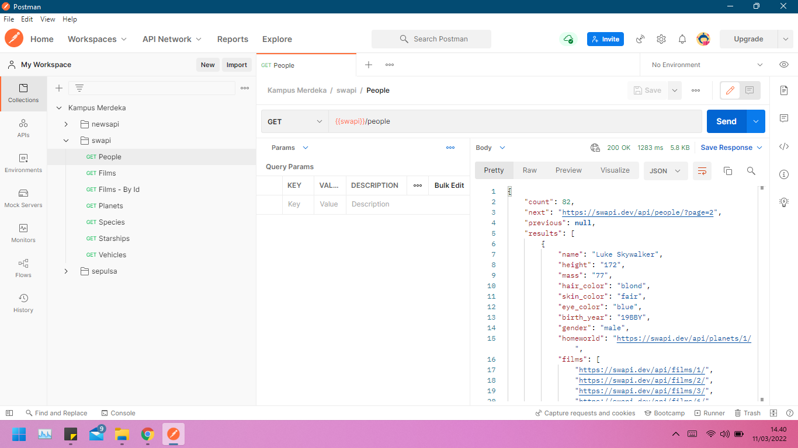
- Endpoint : `/films`
  
- Endpoint : `/films/3`
  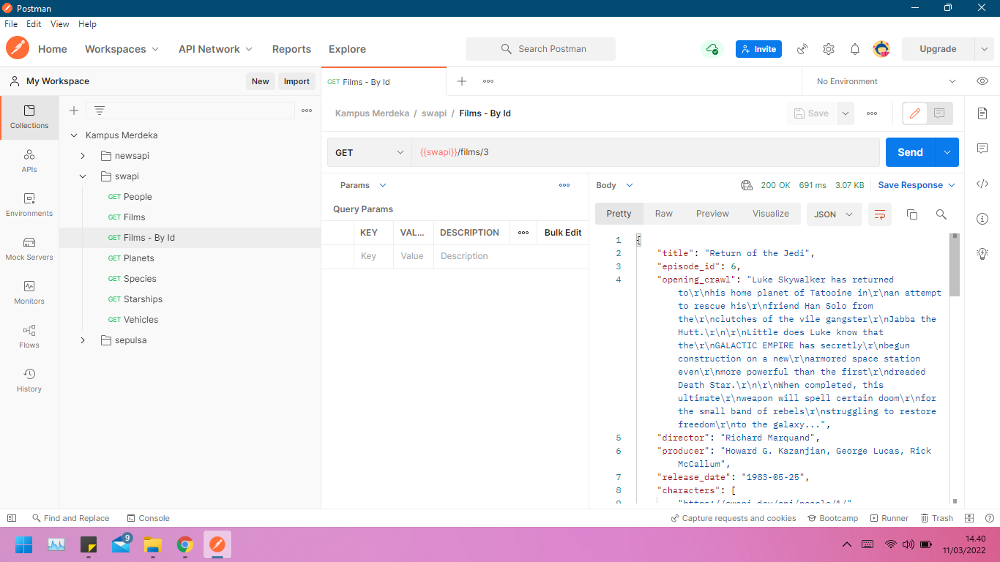
- Endpoint : `/planets`
  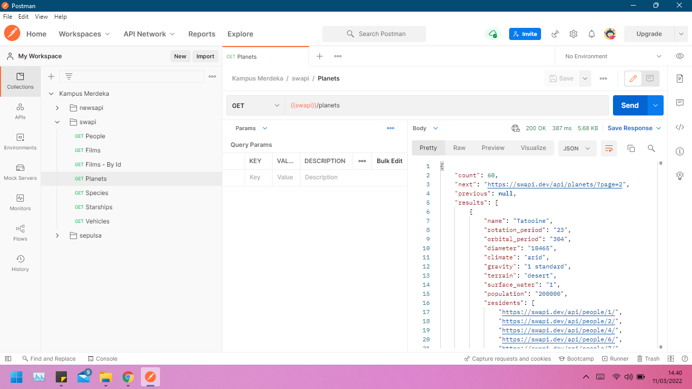
- Endpoint : `/species`
  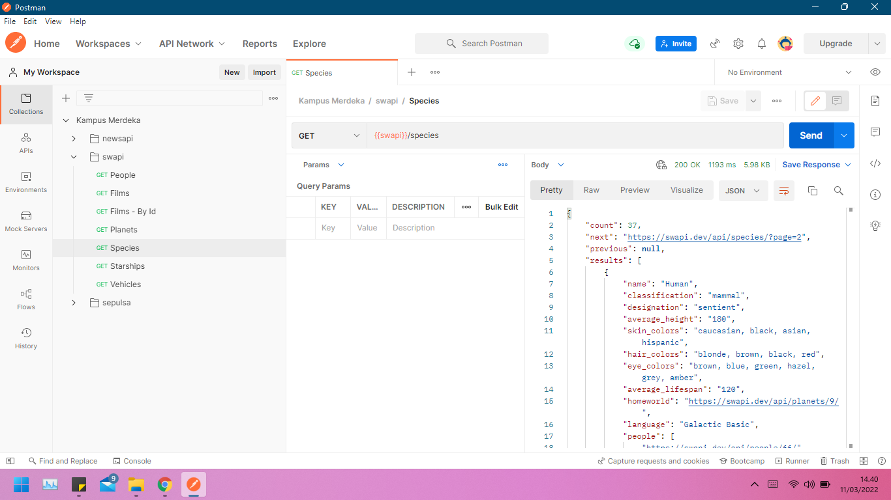
- Endpoint : `/starships`
  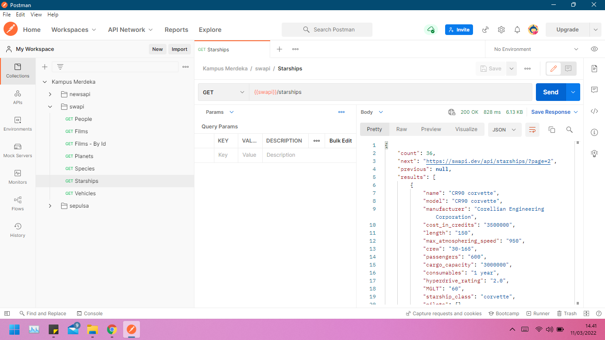
- Endpoint : `/vehicles`
  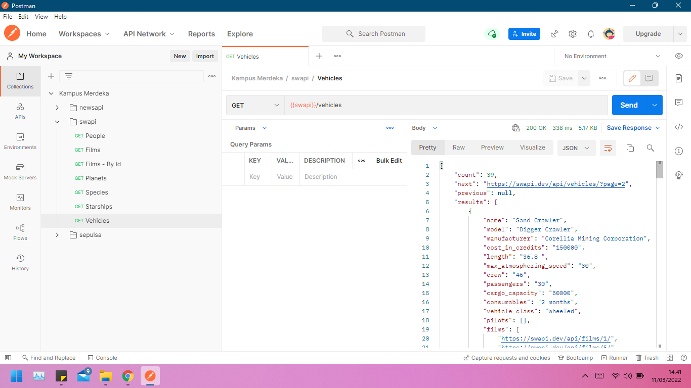

#### C. Target API 3

- Base URL = `https://virtserver.swaggerhub.com/sepulsa/RentABook-API/1.0.0`
- Header :
  - Content-Type: application/json
- Endpoint : `/user`
  - Method : GET
  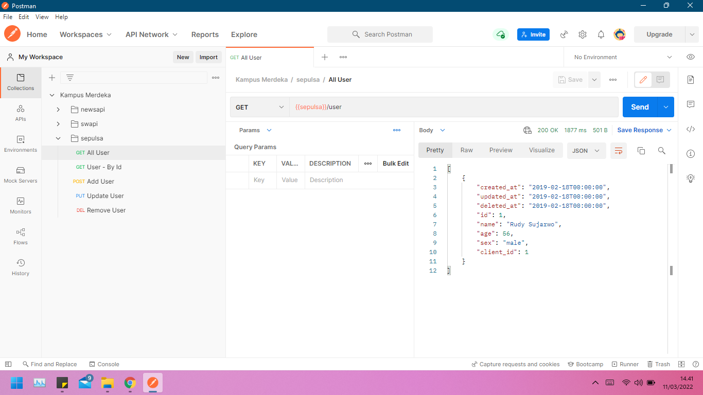
- Endpoint : `/user/1`
  - Method : GET
  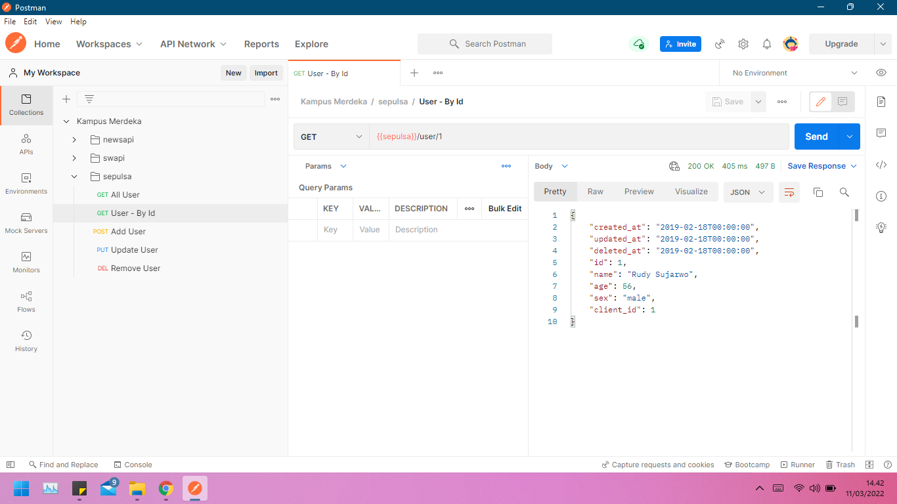
- Endpoint : `/user`
  - Method : POST
  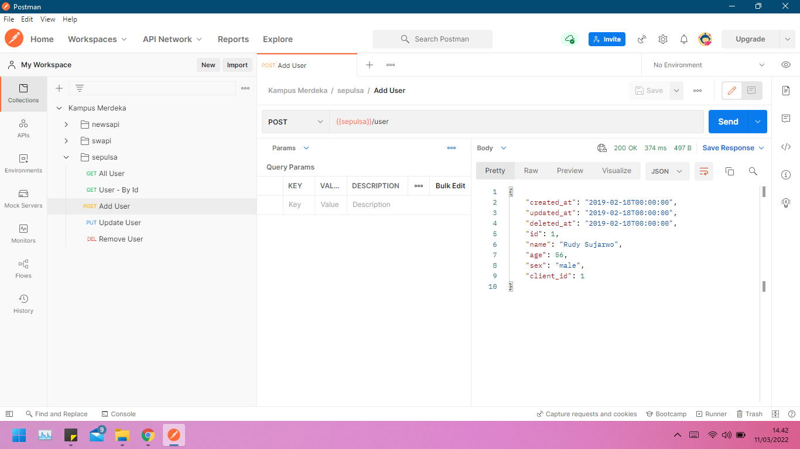
- Endpoint : `/user/1`
  - Method : PUT
  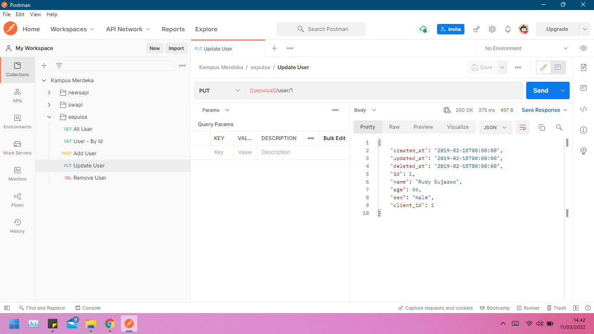
- Endpoint : `/user/1`
  - Method : DELETE
  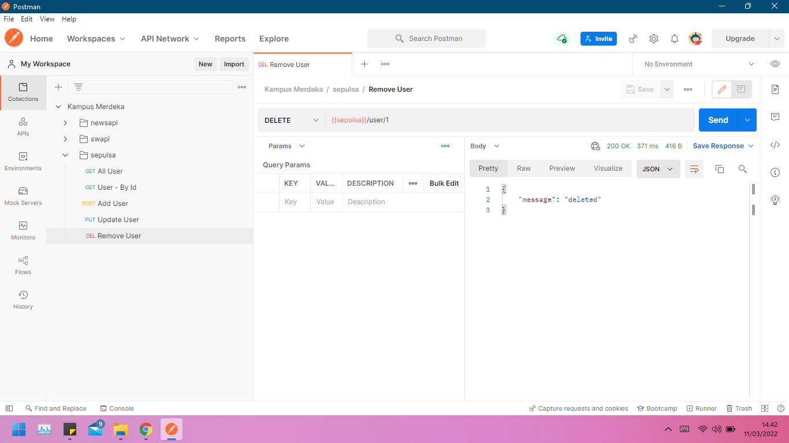
