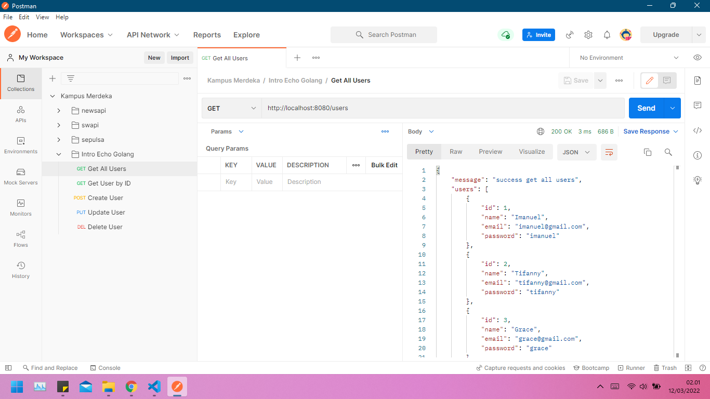

# (20) Intro Echo Golang

## Resume

`Echo` adalah framework bahasa golang untuk pengembangan aplikasi web. Framework ini cukup terkenal di komunitas. Echo merupakan framework besar, di dalamnya terdapat banyak sekali dependensi. Dari banyak routing library yang sudah penulis gunakan, hampir seluruhnya mempunyai kemiripan dalam hal penggunaannya, cukup panggil fungsi/method yang dipilih (biasanya namanya sama dengan HTTP Method), lalu sisipkan rute pada parameter pertama dan handler pada parameter kedua.

Untuk menggunakan Echo, download dan import dulu package echo.
Mendownload dapat dilakukan dengan command `go get github.com/labstack/echo/v4` dan lakukan import package `github.com/labstack/echo/v4`.

```go
route := echo.New()
route.GET("/", handler)
route.Start(":8000")
```

Sebuah objek router `route` dicetak lewat `echo.New()`. Lalu lewat objek router tersebut, dilakukan registrasi ruote untuk / dengan method `GET` dan handler adalah closure `handler`. Terakhir, dari objek router di-start-lah sebuah web server pada port 8000.

> Echo router mengadopsi konsep `radix tree`, membuat performa lookup nya begitu cepat. Tak juga itu, pemanfaatan sync pool membuat penggunaan memory lebih hemat, dan aman dari GC overhead.

```go
package main

import (
    "fmt"
    "github.com/labstack/echo/v4"
    "net/http"
    "strings"
)

type M map[string]interface{}

func main() {
    r := echo.New()

    r.GET("/", func(ctx echo.Context) error {
        data := "Hello from /index"
        return ctx.String(http.StatusOK, data)
    })

    r.Start(":8000")
}
```

Routing dengan memanfaatkan package `net/http` dalam penerapannya adalah menggunakan http.HandleFunc() atau http.Handle(). Berbeda dengan Echo, routingnya adalah method-based, tidak hanya endpoint dan handler yang di-registrasi, method juga.

Statement `echo.New()` mengembalikan objek mux/router. Pada kode di atas rute / dengan method GET di-daftarkan. Selain r.GET() ada banyak lagi method lainnya, semua method dalam spesifikasi REST seperti PUT, POST, GET, DELETE dan lainnya bisa digunakan.

## Task

- Base URL = `http://localhost:8080`
- Header :
  - Content-Type: application/json

### Get All Users

- Method : `GET`
- Endpoint : `/users`


### Get User

- Method : `GET`
- Endpoint : `/users/:id`


### Create User

- Method : `POST`
- Endpoint : `/users`
- Request:
  | Field | Type |
  | :------ | :-------- |
  | name | string |
  | email | string |
  | password | string |


### Update User

- Method : `PUT`
- Endpoint : `/users/:id`
- Request:
  | Field | Type |
  | :------ | :-------- |
  | name | string |
  | email | string |
  | password | string |


### Delete User

- Method : `DELETE`
- Endpoint : `/users/:id`


