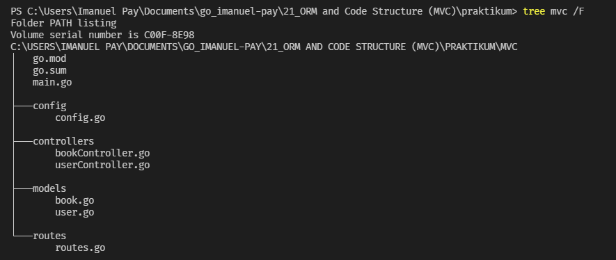

# (21) ORM and Code Structure (MVC)

## Resume

### Object-Relational Mapping (ORM)

`Object-Relational Mapping (ORM)` : adalah teknik yang memungkinkan Anda melakukan kueri dan memanipulasi data dari database menggunakan paradigma berorientasi objek. Ketika berbicara tentang ORM, kebanyakan orang mengacu pada perpustakaan yang mengimplementasikan teknik Pemetaan Obyek-Relasional.

Pustaka ORM adalah pustaka biasa yang ditulis dalam bahasa pilihan Anda yang merangkum kode yang diperlukan untuk memanipulasi data, sehingga Anda tidak menggunakan SQL lagi; Anda berinteraksi langsung dengan objek dalam bahasa yang sama dengan yang Anda gunakan.

Kekurangan dan Kelebihan:

- Menggunakan ORM menghemat banyak waktu karena:
  - Anda menulis model data Anda hanya di satu tempat, dan lebih mudah untuk memperbarui, memelihara, dan menggunakan kembali kode.
  - Banyak hal dilakukan secara otomatis, mulai dari penanganan basis data hingga I18N.
  - Ini memaksa Anda untuk menulis kode MVC, yang pada akhirnya membuat kode Anda sedikit lebih bersih.
  - Anda tidak perlu menulis SQL dengan format yang buruk (sebagian besar pemrogram Web benar-benar payah dalam hal itu, karena SQL diperlakukan seperti bahasa "sub", padahal sebenarnya bahasa itu sangat kuat dan kompleks).
  - sanitasi; menggunakan pernyataan atau transaksi yang disiapkan semudah memanggil metode.

- Menggunakan perpustakaan ORM lebih fleksibel karena:
  - Ini cocok dengan cara pengkodean alami Anda (itu bahasa Anda!).
  - Ini mengabstraksi sistem DB, sehingga Anda dapat mengubahnya kapan pun Anda mau.
  - Model terikat lemah dengan aplikasi lainnya, sehingga Anda dapat mengubahnya atau menggunakannya di tempat lain.
  - Ini memungkinkan Anda menggunakan kebaikan OOP seperti pewarisan data tanpa pusing.

- Tapi ORM memiliki kekurangan seperti:
  - Anda harus mempelajarinya, dan pustaka ORM bukanlah alat yang ringan;
  - Anda harus mengaturnya. Permasalahan yang sama.
  - Performanya OK untuk kueri biasa, tetapi master SQL akan selalu melakukan yang lebih baik dengan SQL-nya sendiri untuk proyek besar.
  - Ini mengabstraksi DB. Meskipun tidak apa-apa jika Anda tahu apa yang terjadi di balik layar, ini adalah jebakan bagi pemrogram baru yang dapat menulis pernyataan yang sangat rakus, seperti pukulan berat dalam perulangan for.

### Code Structure MVC

`Model View Controller` atau yang dapat disingkat `MVC` adalah sebuah pola arsitektur dalam membuat sebuah aplikasi dengan cara memisahkan kode menjadi tiga bagian yang terdiri dari:

- `Model`, Bagian yang bertugas untuk menyiapkan, mengatur, memanipulasi, dan mengorganisasikan data yang ada di database.

- `View`, Bagian yang bertugas untuk menampilkan informasi dalam bentuk Graphical User Interface (GUI).

- `Controller`, Bagian yang bertugas untuk menghubungkan serta mengatur model dan view agar dapat saling terhubung.

Alur Model View Controller:

- Proses pertama adalah `view` akan meminta data untuk ditampilkan dalam bentuk grafis kepada pengguna.
- Permintaan tersebut diterima oleh `controller` dan diteruskan ke `model` untuk diproses.
- `Model` akan mencari dan mengolah data yang diminta di dalam `database`
- Setelah data ditemukan dan diolah, `model` akan mengirimkan data tersebut kepada `controller` untuk ditampilkan di `view`.
- `Controller` akan mengambil data hasil pengolahan `model` dan mengaturnya di bagian `view` untuk ditampilkan kepada pengguna.

Manfaat dari MVC:

- Proses pengembangan aplikasi menjadi lebih efisien
- Penulisan kode menjadi lebih rapi
- Dapat melakukan testing dengan lebih mudah
- Perbaikan bug atau error lebih cepat untuk diselesaikan
- Mempermudah pemeliharaan

## Task

### Problem 1 - ORM

Source code: [main.go](praktikum/main.go)

- Base URL = `http://localhost:8080`
- Header :
  - Content-Type: application/json

#### Get All Users

- Method : `GET`
- Endpoint : `/users`

#### Get User

- Method : `GET`
- Endpoint : `/users/:id`

#### Create User

- Method : `POST`
- Endpoint : `/users`
- Request:
  | Field | Type |
  | :------ | :-------- |
  | name | string |
  | email | string |
  | password | string |

#### Update User

- Method : `PUT`
- Endpoint : `/users/:id`
- Request:
  | Field | Type |
  | :------ | :-------- |
  | name | string |
  | email | string |
  | password | string |

#### Delete User

- Method : `DELETE`
- Endpoint : `/users/:id`

### Problem 2 - MVC

Source code: [Folder MVC](praktikum/mvc/)

Code Structure:

- Base URL = `http://localhost:8080`
- Header :
  - Content-Type: application/json

#### Get All Users - MVC

- Method : `GET`
- Endpoint : `/users`

#### Get User - MVC

- Method : `GET`
- Endpoint : `/users/:id`

#### Create User - MVC

- Method : `POST`
- Endpoint : `/users`
- Request:
  | Field | Type |
  | :------ | :-------- |
  | name | string |
  | email | string |
  | password | string |

#### Update User - MVC

- Method : `PUT`
- Endpoint : `/users/:id`
- Request:
  | Field | Type |
  | :------ | :-------- |
  | name | string |
  | email | string |
  | password | string |

#### Delete User - MVC

- Method : `DELETE`
- Endpoint : `/users/:id`

#### Get All Books - MVC

- Method : `GET`
- Endpoint : `/books`

#### Get Book - MVC

- Method : `GET`
- Endpoint : `/books/:id`

#### Create Book - MVC

- Method : `POST`
- Endpoint : `/books`
- Request:
  | Field | Type |
  | :------ | :-------- |
  | name | string |
  | author | string |
  | publisher | string |

#### Update Book - MVC

- Method : `PUT`
- Endpoint : `/books/:id`
- Request:
  | Field | Type |
  | :------ | :-------- |
  | name | string |
  | author | string |
  | publisher | string |

#### Delete Book - MVC

- Method : `DELETE`
- Endpoint : `/books/:id`

