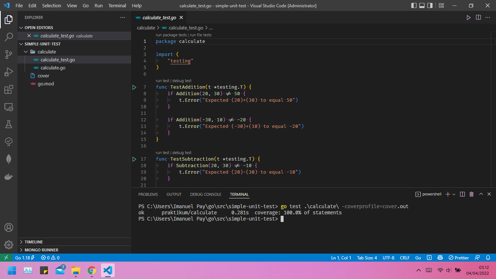
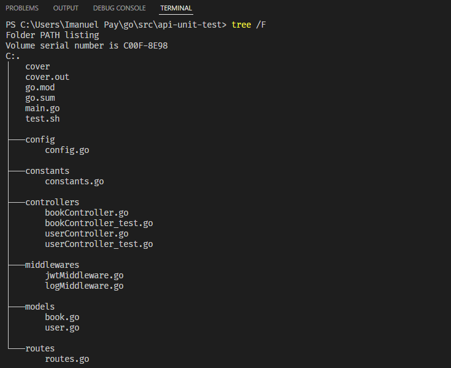
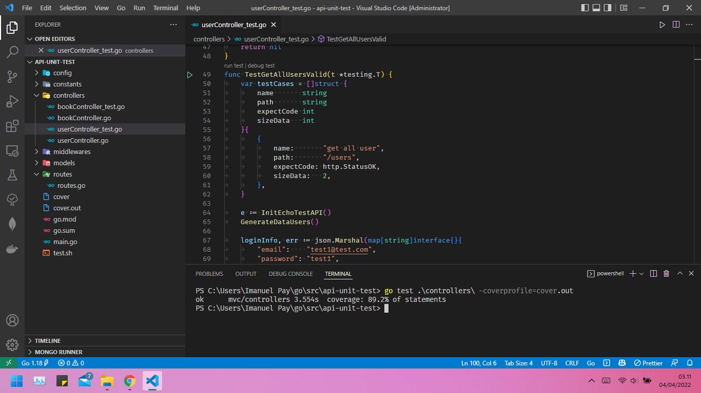

# 23 Unit Testing

## Resume

`Software testing` merupakan suatu investigasi yang dilakukan untuk mendapatkan informasi mengenai kualitas dari produk atau layanan yang sedang diuji (under test).Pengujian perangkat lunak juga memberikan pandangan mengenai perangkat lunak secara obyektif dan independen, yang bermanfaat dalam operasional bisnis untuk memahami tingkat risiko pada implementasinya. Teknik-teknik pengujian mencakup, tetapi tidak terbatas pada, proses mengeksekusi suatu bagian program atau keseluruhan aplikasi dengan tujuan untuk menemukan bug perangkat lunak (kesalahan atau cacat lainnya).

Fase-fase pada Software Testing:

- `Requirement analysis` : Analisis persyaratan adalah langkah pertama dimana pengujian siklus dimulai dengan tinjauan umum persyaratan user. Tujuan dari requirement analysis adalah untuk memahami persyaratan yang penting untuk pengujian sebuah produk.
- `Test Case Design and Development` : Langkah ini digunakan untuk menemukan apa saja persyaratan komponen yang diperlukan. Spesifikasi desain diuji dan diperiksa dan membuat tinjauan atau review dari test spesifikasi.
- `Test Execution` : Pada tahap ini, melakukan peninjauan pada kode atau program yang ada. Melakukan eksekusi program, evaluasi tes dan memberikan hasil dari simulasi yang dilakukan.
- `Test Closure` : Tahap ini menghasilkan ringkasan dari testing yang telah dilakukan dan menyiapkan dokumentasi dari suatu proyek atau software.
- `Test Process Analysis` : Ringkasan akan dianalisis untuk meningkatkan kinerja dari suatu aplikasi dengan menggunakan teknologi baru atau menambahkan fitur-fitur tambahan yang diperlukan.

Level pada Software Testing :

- `Unit Testing` : Unit Testing adalah bagian terkecil yang dapat diuji dari seluruh aplikasi. Tujuannya untuk memberikan sepotong kode yang harus memenuhi persyaratan.
- `Integration Testing` : Dalam integration testing, kode akan dibagi menjadi beberapa segmen dan diuji sebagai kelompok. Tugas utama integration testing adalah untuk menganalisis parameter seperti persyaratan fungsional, persyaratan kinerja dan persyaratan keandalan yang ditempatkan pada item desain utama.
- `Function Testing` : Function Testing dapat disebut sebagai black-box testing. Dalam function testing, pengujian dilakukan dengan memberikan input yang valid, dan hasilnya dari diamati.
- `System Testing` : Ini dianggap sebagai jenis pengujian yang lebih terbatas, system testing berusaha mendeteksi segala cacat dalam unit perangkat lunak yang terintegrasi bersama.
- `Acceptance testing`: dikenal juga sebagai pengujian penerimaan operasional atau pengujian penerimaan lapangan karena dijalankan dengan mengikuti prosedur tes penerimaan yang telah ditentukan untuk mengarahkan pengguna tentang data mana yang akan digunakan setelah mengikuti prosedur langkah demi langkah.
- `Regression testing`: pada regression testing, aplikasi yang dikembangkan akan diuji dan menganalisis error atau penyimpangan yang ada ketika perubahan dibuat di program baru.

Go menyediakan package `testing`, berisikan banyak sekali tools untuk keperluan unit test dan benchmark. File untuk keperluan testing dipisah dengan file utama, namanya harus berakhiran `_test.go`, dan package-nya harus sama. Unit test di Go dituliskan dalam bentuk fungsi, yang memiliki parameter yang bertipe `*testing.T`, dengan nama fungsi harus diawali kata `Test`.Cara eksekusi testing adalah menggunakan command `go test`.

```go
package main

import "testing"

func TestFunction(t *testing.T) {
    // testing kondisi disini
}
```

Method Test:
| Method | Kegunaan |
| ------ | -------- |
| `Log()` | Menampilkan log |
| `Logf()` | Menampilkan log menggunakan format |
| `Fail()` | Menandakan terjadi `Fail()` dan proses testing fungsi tetap diteruskan |
| `FailNow()` | Menandakan terjadi `Fail()` dan proses testing fungsi dihentikan |
| `Failed()` | Menampilkan laporan fail |
| `Error()` | `Log()` diikuti dengan `Fail()` |
| `Errorf()` | `Logf()` diikuti dengan `Fail()` |
| `Fatal()` | `Log()` diikuti dengan `failNow()` |
| `Fatalf()` | `Logf()` diikuti dengan `failNow()` |
| `Skip()` | `Log()` diikuti dengan `SkipNow()` |
| `Skipf()` | `Logf()` diikuti dengan `SkipNow()` |
| `SkipNow()` | Menghentikan proses testing fungsi, dilanjutkan ke testing fungsi setelahnya |
| `Skiped()` | Menampilkan laporan skip |
| `Parallel()` | Menge-set bahwa eksekusi testing adalah parallel |

`Benchmark` dan parameternya bertipe `*testing.B`

```go
func BenchmarkFunction(b *testing.B) {
    for i := 0; i < b.N; i++ {
        // testing function disini
    }
}
```

Package `testify` berisikan banyak sekali tools yang bisa dimanfaatkan untuk keperluan testing di Go.

`Testify` bisa di-download pada `github.com/stretchr/testify` menggunakan go get.

| Package | Kegunaan |
| ------- | -------- |
| `assert` | Berisikan tools standar untuk testing |
| `http` | Berisikan tools untuk keperluan testing http |
| `mock` | Berisikan tools untuk mocking object
| `require` | Sama seperti assert, hanya saja jika terjadi fail pada saat test akan menghentikan eksekusi program |
| `suite` | Berisikan tools testing yang berhubungan dengan struct dan method |

## Task

### Problem 1 - Unit Testing Implementation

#### Simple Unit Testing

Source code: [Folder simple-unit-test](praktikum/simple-unit-test/)

Output:



#### RESTful API Testing

Source code: [Folder api-unit-test](praktikum/api-unit-test/)

Code Structure:



Output:


