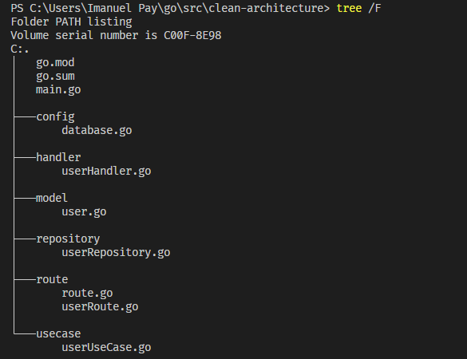

# (24) Clean and Hexagonal Architecture

## Resume

Arsitektur yang baik adalah pemisahan perhatian menggunakan layer untuk membangun aplikasi modular, terukur, dapat dipelihara, dan dapat diuji.

`Arsitektur heksagonal` adalah pola arsitektur dalam rekayasa perangkat lunak di mana batas / antarmuka tertentu didefinisikan sebagai tepi segi enam. Pola ini juga disebut dengan `port` and `adapters pattern`, yang lebih deskriptif untuk implementasi sebenarnya. Arsitektur heksagonal adalah implementasi dari subset dari prinsip-prinsip `SOLID`, terutama D dari "Dependency inversion", tetapi juga L dari "Liskov substitution". Dengan `Domain Driven Design (DDD)`, arsitektur heksagonal (dan prinsip `SOLID`) sangat cocok dengan arsitektur microservice. Dengan DDD Anda menentukan batas layanan, dan dengan arsitektur heksagonal Anda mengimplementasikan antarmuka domain. Domain itu sendiri kemudian bersih dari dependensi dan implementasi tertentu, tetapi berisi logika bisnis tentang apa layanan itu - mengapa ia memiliki alasan keberadaannya di tempat pertama. Setiap adaptor yang mengimplementasikan salah satu antarmuka (port) domain dapat dilihat sebagai segi enam lain yang menempel pada segi enam tengah dengan satu sisi. Layanan mikro lengkap adalah kumpulan segi enam bersama-sama di mana domain itu sendiri dienkapsulasi oleh adaptornya.

Dalam konsep `clean architecture`, setiap komponen yang ada bersifat independen dan tidak bergantung pada library external yang spesifik. Seperti tidak tergantung pada spesifik framework atau tidak bergantung pada spesifik database yang dipakai.

Secara global, arsitektur ini dapat dibagi menjadi 4 layer (tidak harus seperti ini):

- `Entities`
- `Use Cases`
- `Interface Adapters`
- `Framework and Drivers`

`Entities`
Mendefinisikan business rule yang dipakai bersama di keseluruhan aplikasi enterprise. Bisa berupa object dengan method, atau struktur data.

`Use Cases`
Mendefinisikan logika kasus spesifik penggunaan aplikasi dalam bentuk use case.

`Interface Adapters`
Mengkomunikasikan antara framework/driver dengan aplikasi, dan sebaliknya. Kalau kita menggunakan framework seperti Web MVC, maka letaknya hanya di layer ini. Data akan dikonversi menjadi bentuk yang dapat digunakan oleh aplikasi (use case/entities).

`Framework and Driver`
Layer ini berisi framework dan driver, misal web framework dan database driver. Yang dilakukan di layer ini seharusnya cukup menyambungkan antara framework/driver dengan layer-layer di dalamnya.

Pemisahan antara business rules, system dan user interface. Secara detail, masing-masing dari konsep tersebut memiliki karakteristik sebagai berikut:

- `Independen dari framework` dimana arsitektur sistem tidak bergantung pada keberadaan library dari framework tersebut,
- `Testable` dimana business rules dapat dites tanpa menggunakan user interface (UI), database, web server atau elemen eksternal lainnya,
- `Independen dari UI`, sehingga apabila terjadi perubahan pada UI tidak akan mempengaruhi sistem dan business rules
- `Independen dari database` dimana sistem dapat diimplementasikan pada server database manapun tanpa mempengaruhi business rules
- `Independen dari agent` eksternal manapun

## Task

### Problem 1 - Rewrite

Source code: [Folder clean-architecture](praktikum/clean-architecture/)

Code Structure:

