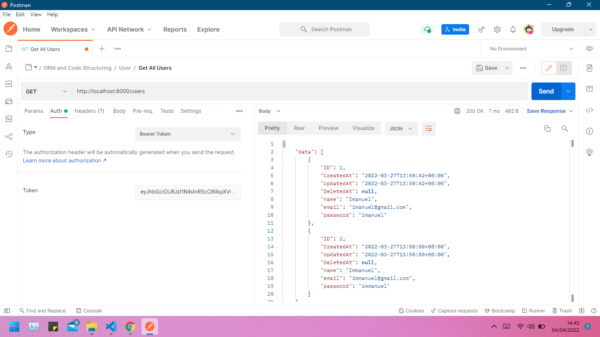

# (25) Clean Architecture JWT

## Resume

Pada konsep `clean architecture` setiap komponen bersifat independen dan di kelompokan berdasarkan fungsinya. Hal ini bertujuan agar code lebih mudah di kembangkan ke tingkan yang lebih komplek dan memudahkan dalam maintenance ataupun unit testing.

Dalam contoh codingan yang saya sematkan di bawah, saya membagi codemenjadi 4 layer sebagai fungsi utama dan 2 interface untuk menjembati komunikasi antar layer yaitu

- Model
- Repository
- Usecase
- Handler

`JSON Web Token` adalah standar Internet yang diusulkan untuk membuat data dengan tanda tangan opsional dan/atau enkripsi opsional yang muatannya menampung `JSON` yang menegaskan sejumlah klaim. Token ditandatangani baik menggunakan rahasia pribadi atau kunci publik/pribadi. Konsep dari JSON Web Token atau lebih dikenal dengan JWT yang mana JWT ini adalah sebuah token berbentuk string panjang yang sangat random yang gunanya sendiri untuk melakukan sistem Autentikasi dan Pertukaran Informasi. Umumnya untuk melakukan login tidak seperti pada aplikasi website biasa dimana kita menggunakan session untuk mengingat siapa yang sedang Login.

Untuk mengimplemantasi `JWT` pada `clean architecture`, saya menaruh JWT tersebut pada `Layer Handler`, karena `Handler` adalah layer yang menjadi penghubung antara user dan sistem itu sendiri, yang di dalamnya terdapat akses endpoint yang bisa di akses oleh user yang akan menghasilkan output data dan respon yang siap untuk di gunakan. Dan karena handler ini berinteraksi langsung dengan user, di dalam handler ini juga terdapat validasi-validasi yang sudah di tentukan untuk mengotrol interaksi dengan user.

## Task

### Problem 1 - JWT Implementation

Source code: [Folder clean-architecture-jwt](praktikum/clean-architecture-jwt/)

Code Structure:

Output:

