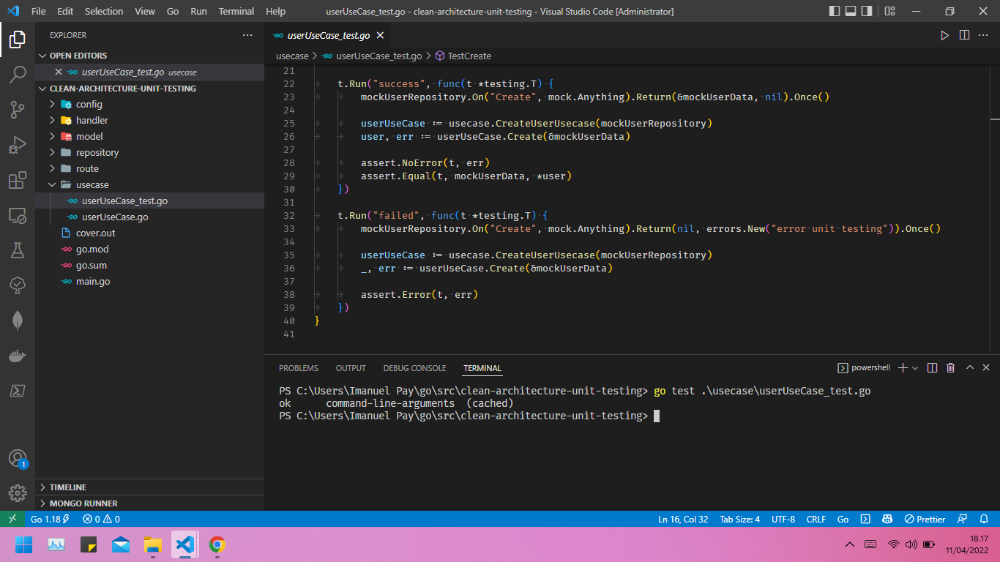

# (26) Clean Architecture Unit Test

## Resume

Pada konsep `clean architecture` setiap komponen bersifat independen dan di kelompokan berdasarkan fungsinya. Hal ini bertujuan agar code lebih mudah di kembangkan ke tingkan yang lebih komplek dan memudahkan dalam maintenance ataupun unit testing.

Dalam contoh codingan yang saya sematkan di bawah, saya membagi codemenjadi 4 layer sebagai fungsi utama dan 2 interface untuk menjembati komunikasi antar layer yaitu

- Model
- Repository
- Usecase
- Handler

Go menyediakan package `testing`, berisikan banyak sekali tools untuk keperluan unit test dan benchmark. File untuk keperluan testing dipisah dengan file utama, namanya harus berakhiran `_test.go`, dan package-nya harus sama. Unit test di Go dituliskan dalam bentuk fungsi, yang memiliki parameter yang bertipe `*testing.T`, dengan nama fungsi harus diawali kata `Test`.Cara eksekusi testing adalah menggunakan command `go test`.

Method Test:
| Method | Kegunaan |
| ------ | -------- |
| `Log()` | Menampilkan log |
| `Logf()` | Menampilkan log menggunakan format |
| `Fail()` | Menandakan terjadi `Fail()` dan proses testing fungsi tetap diteruskan |
| `FailNow()` | Menandakan terjadi `Fail()` dan proses testing fungsi dihentikan |
| `Failed()` | Menampilkan laporan fail |
| `Error()` | `Log()` diikuti dengan `Fail()` |
| `Errorf()` | `Logf()` diikuti dengan `Fail()` |
| `Fatal()` | `Log()` diikuti dengan `failNow()` |
| `Fatalf()` | `Logf()` diikuti dengan `failNow()` |
| `Skip()` | `Log()` diikuti dengan `SkipNow()` |
| `Skipf()` | `Logf()` diikuti dengan `SkipNow()` |
| `SkipNow()` | Menghentikan proses testing fungsi, dilanjutkan ke testing fungsi setelahnya |
| `Skiped()` | Menampilkan laporan skip |
| `Parallel()` | Menge-set bahwa eksekusi testing adalah parallel |

Package `testify` berisikan banyak sekali tools yang bisa dimanfaatkan untuk keperluan testing di Go.

`Testify` bisa di-download pada `github.com/stretchr/testify` menggunakan go get.

| Package | Kegunaan |
| ------- | -------- |
| `assert` | Berisikan tools standar untuk testing |
| `http` | Berisikan tools untuk keperluan testing http |
| `mock` | Berisikan tools untuk mocking object
| `require` | Sama seperti assert, hanya saja jika terjadi fail pada saat test akan menghentikan eksekusi program |
| `suite` | Berisikan tools testing yang berhubungan dengan struct dan method |

## Task

### Problem 1 - Rewrite

Source code: [Folder clean-architecture-unit-testing](praktikum/clean-architecture-unit-testing/)

Output:

