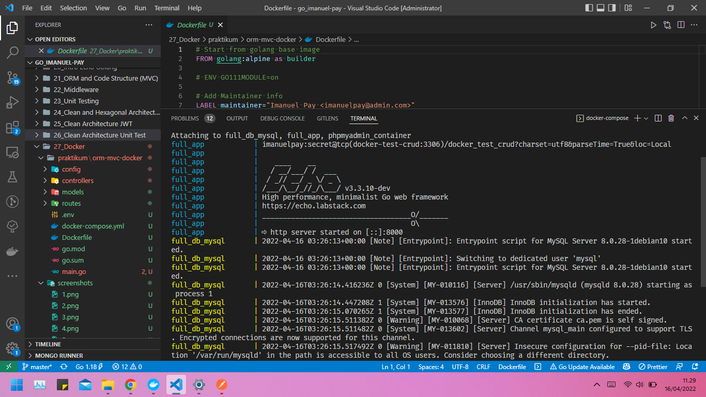

# 21 Docker

## Resume

`Docker` adalah layanan yang menyediakan kemampuan untuk mengemas dan menjalankan sebuah aplikasi dalam sebuah lingkungan terisolasi yang disebut dengan container. Dengan adanya isolasi dan keamanan yang memadai memungkinkan kamu untuk menjalankan banyak container di waktu yang bersamaan pada host tertentu.

Docker ini diperkenalkan pada tahun 2013 oleh Solomon Hykes pada acara PyCon. Beberapa bulan setelahnya docker secara resmi diluncurkan, tepatnya pada tahun 2014. Semenjak itu docker menjadi sangat populer di kalangan developer luar negeri, tetapi belum terlalu populer di Indonesia.

Fitur-fitur docker:

- Docker engine
- Docker Hub
- Docker Compose
- Docker for Mac
- Docker for Linux
- Docker for Windows

Kelebihan:

- Memiliki konfigurasi yang sederhana
- Tingkat keamanan yang baik
- Dapat dijalankan pada beberapa platform cloud
- Dapat melakukan debugging
- Dapat digunakan pada berbagai sistem operasi

## Task

Source code: [Folder orm-mvc-docker](praktikum/orm-mvc-docker/)

Selesai Instalasi Docker:

Membuat Dockerfile:

Membuat docker-compose:

Docker build:

Docker push ke repository:

Docker compose up:

API test:

