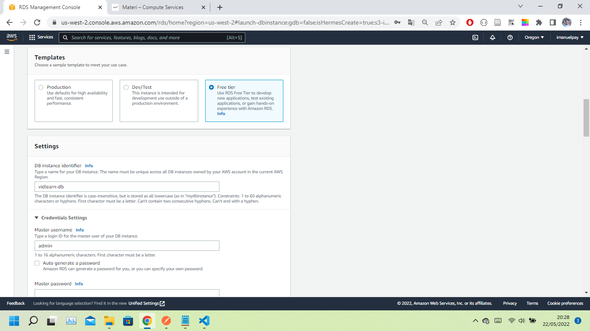

# 28 Compute Services

## Resume

`Cloud computing` adalah sebuah konsep pemahaman dalam rangka pembuatan kerangka kerja komputasi secara online lokal (LAN) maupun global (internet) dimana terdapat beragam aplikasi maupun data dan media penyimpanan yang dapat diakses dan digunakan secara berbagi (shared service) dan bersamaan (simultaneous access) oleh para pengguna yang beragam – mulai dari perseorangan sampai kepada kelas pengguna korporasi atau perusahaan.

Cloud Computing adalah suatu metoda komputasi di mana kapabilitas terkait teknologi informasi disajikan sebagai suatu layanan (as a service), sehingga pengguna dapat mengaksesnya lewat Internet (“di dalam awan”) tanpa mengetahui apa yang ada didalamnya, mengerti apa yang di dalamnya, ataupun memiliki kendali terhadap infrastruktur teknologi yang membantunya.

Tipe Cloud Service Model. Yang mana terdiri dari Infrastructure as a Service (IaaS), Platform as a Service (PaaS) dan yang terakhir adalah Software as a Service (SaaS).

- `Infrastructure as a Service`, Pengertian dari Infrastructure as a Service adalah layanan Cloud Computing yang memanfaatkan sumber daya komputasi yang terpusat dan berskala besar sehingga memungkinkan bisnis untuk membeli sumber daya komputasi sesuai permintaan dan kebutuhan daripada harus membeli perangkat keras secara langsung. Fitur utama dari `IaaS` adalah scalable, elastic, reliable and automatic. IaaS sepenuhnya self-service untuk mengakses dan memantau komputer, jaringan, penyimpanan, dan layanan lainnya.
- `Platform as a Service`, juga dikenal sebagai `PaaS`, menyediakan komponen cloud ke perangkat lunak tertentu saat digunakan terutama untuk aplikasi. PaaS memberikan kerangka kerja untuk Developer yang dapat mereka bangun dan gunakan untuk membuat aplikasi yang disesuaikan kebutuhan mereka. Semua server, penyimpanan, dan jaringan dapat dikelola oleh perusahaan atau penyedia pihak ketiga, sementara Developer dapat mengelola manajemen aplikasi. Salah satu contoh dari Platform as a Service adalah Layanan Managed Kubernetes dari Datacomm Cloud Business.
- `Software as a Service` atau `SaaS`, mewakili pilihan yang paling umum digunakan untuk bisnis di pasar cloud. SaaS menggunakan internet untuk mengirimkan servis aplikasi kepada pengguna, di mana aplikasi ini dikelola oleh vendor pihak ketiga. Mayoritas aplikasi SaaS berjalan langsung melalui browser web Anda, yang berarti aplikasi tersebut tidak memerlukan unduhan atau penginstalan apa pun di sisi klien.

## Task

### Deployment EC2

EC2 Dashboard:

Create Instances:

Remote Instances:

### Deployment RDS

RDS Dashboard:

Create Database:

Remote Database:

### Deployment App with EC2, RDS and MongoDB

