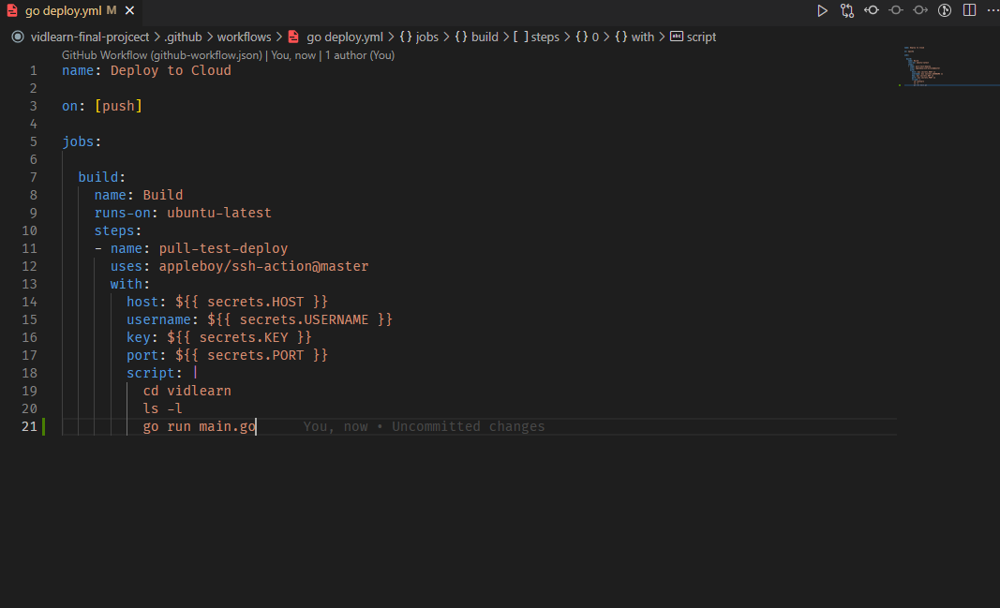
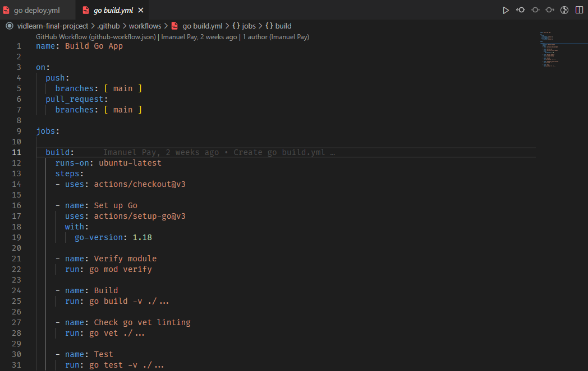
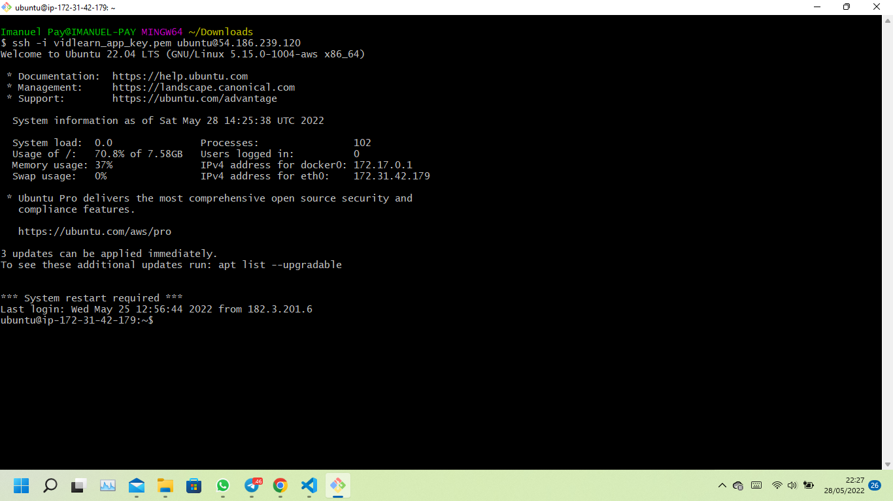
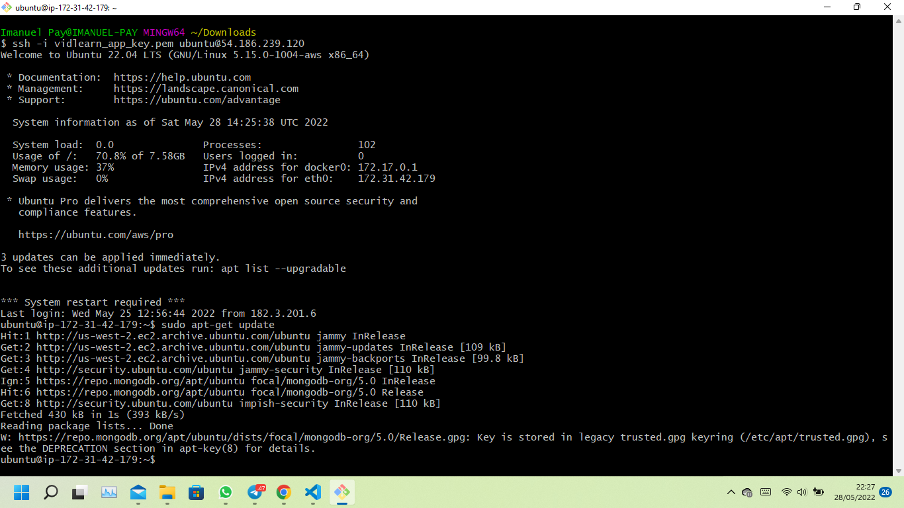
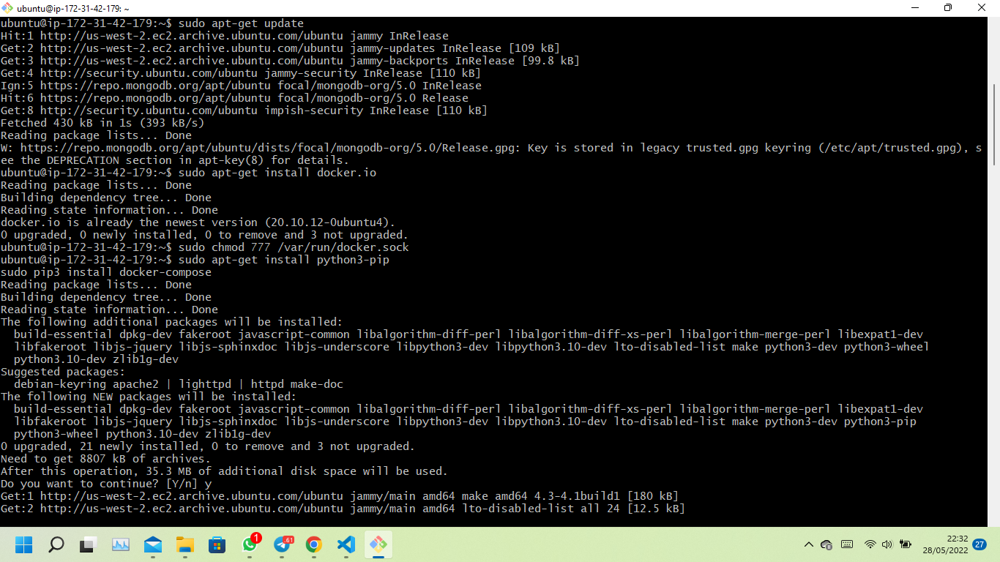
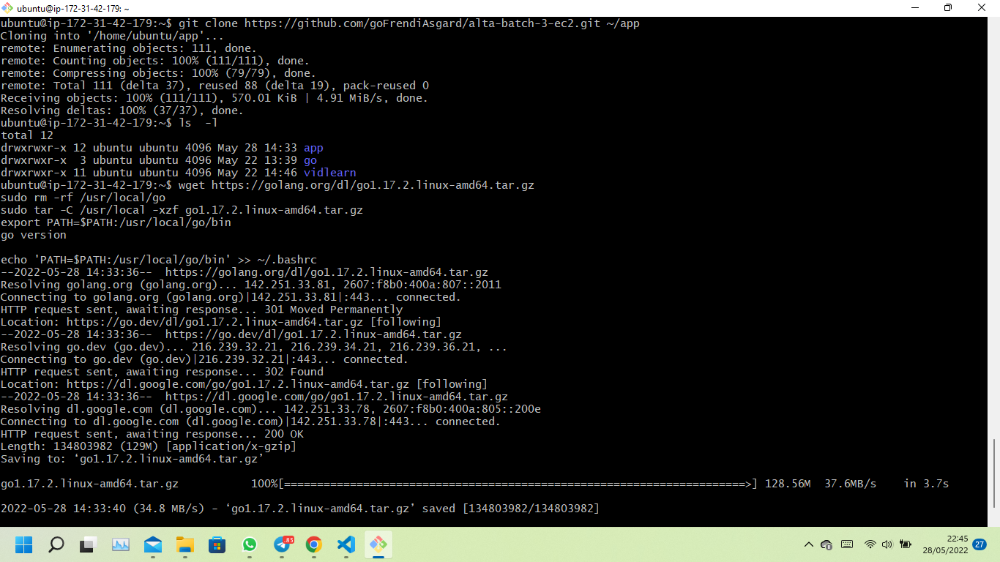

# 29 CI/CD

## Resume

`Continuous Integration (CI)` adalah pengintegrasian kode ke dalam repositori kode kemudian menjalankan pengujian secara otomatis, cepat, dan sering. Kamu dapat melakukan CI ini dengan menggunakan perintah  commit.

`Continous Delivery atau Continuous Deployment (CD)` adalah praktik yang dilakukan setelah proses CI selesai dan seluruh kode berhasil terintegrasi, sehingga aplikasi bisa dibangun lalu dirilis secara otomatis.

`CI/CD pipeline` menjadi penghubung antara tim pengembang dengan tim operasional yang di dalamnya terdapat tiga fase yang berupa continuous integration, continuous delivery, dan continuous  deployment. Ketiga fase tersebut akan dilakukan secara terus menerus dan otomatis untuk mendapatkan perangkat lunak yang andal dan bebas dari bug.

Manfaat dari CI/CD:

- Mendapat feedback lebih cepat
- Dapat mendeteksi bug lebih cepat
- Dapat mempercepat proses rilis

Tools untuk CI/CD:

- Jenkins
- AWS Codebuild
- Azure DevOps
- GitLab CI/CD

## Task

### CI/CD

