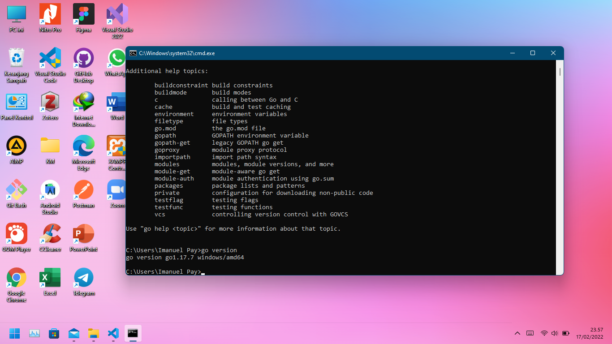
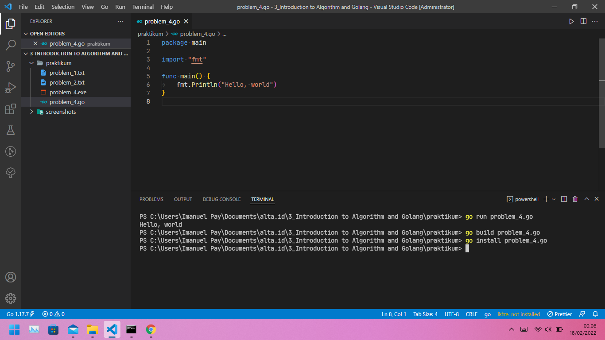

# (03) Introduction to Algorithm and Golang

## Resume

+ Algoritma adalah prosedur komputasi yang didefinisikan dengan baik yang mengambil beberapa nilai sebagai input dan menghasilkan beberapa nilai sebagai output.

+ Karakteristik algoritma, yaitu memiliki batas (awal dan akhir), instruksi terdefinisi dengan baik, dan efektif dan efisien. Contoh dari algoritmas seperti pengecekkan bilangan prima, pengurutan dan pencarian.

+ Algoritma dasar seperti Sequential, Branching, dan Looping. Algoritma dapat di implementasi dengan Pseudocode atau Flowchart. Flowchart adalah suatu bagan dengan simbol tertentu yang menggambarkan urutan dan hubungan antar proses secara mendetail. Sedangkan Pseudocode adalah sebuah deskripsi yang bersifat informal dan disertai dengan rangkuman atau ringkasan dari algoritma pemrograman komputer.

## Task

### Problem 1 - Bilangan Prima

Flowchart untuk menentukan [Bilangan Prima](https://whimsical.com/bilangan-prima-A6AAB8xiEP54zpnNeignhM)

### Problem 2 - Lampu dan tombol

Flowchart Algoritma [Lampu dan tombol](https://whimsical.com/lampu-dan-tombol-WTCuTCeYSvHLRU4oLD9V2x)

### Problem 3 - Install Golang

Untuk menginstall golang, download terlebih dahulu [package installation golang](https://go.dev/dl/)

Berhasil menginstall golang:

### Problem 4 - Hello 

Hasil membuat aplikasi 'Hello, World' dan implementasi beberapa command
