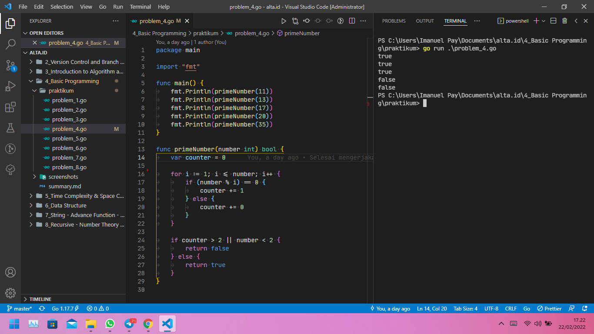

# (04) Basic Programming

## Resume

+ Variabel digunakan untuk menyimpan sebuah nilai atau informasi dalam sebuah program komputer, sebuah variabel memiliki nama dan tipe data(boolean, numerik, string). Sementara tipe data adalah jenis nilai yang akan tersimpan dalam variabel.

+ Dalam Golang terdapat sebuah package bernama "fmt", package ini dapat digunakan untuk mencetak output, meminta inputan dari user, dan format verb.

+ Pada Golang, terdapat beberapa operator seperti arithmetic, comparison, logical, bitwise, assignment, dan miscellaneous. Control structures pada Golang, yaitu branching dan looping. Bracnhing menggunakan if dan switch keyword. Loops menggunakan for keyword.

### Variabel pada Golang

Deklarasi variabel pada golang:

+ `var nama_variabel tipe_data`, Contoh: `var namaLengkap string`
+ `var nama_variabel tipe_data = nilai`, contoh: `var namaLengkap string = "Imanuel Pay"`
+ `var nama_variabel1, nama_variabel2 tipe_data`, contoh: `var namaDepan, namaBelakang string`
+ `var nama_variabel1, nama_variabel2 tipe_data = nilai`, contoh: `var namaDepan, namaBelakang string = "Imanuel", "Pay"`
+ `nama_variabel := nilai`, contoh: `namaLengkap := "Imanuel Pay"`

### Package fmt pada Golang

Import Package terlebih dahulu dibawah package utama.

Contoh:

``` go
package main

// Import Package fmt
import "fmt"

func main() {
    // Deklarasi variabel
    var name string

    // Input
    fmt.Scan(&name)
    
    // Output
    fmt.Println("Hello, " + name)
}

```

### Bracnhing pada Golang

Untuk Bracnhing pada Golang menggunakan keyword if dan switch case

``` go
if kodisi_benar {
    // Lakukan sesuatu
}

if kodisi_benar {
    // Lakukan sesuatu
} else {
    // jika salah
    // Lakukan sesuatu
}

if kodisi_1 {
    // Lakukan sesuatu
} else if kodisi_2 {
    // Lakukan sesuatu
} else {
    // jika bukan kondisi_1 dan kondisi_2
    // Lakukan sesuatu
}

switch expression {
    case kodisi_1:
         // Lakukan sesuatu
    case kodisi_2:
         // Lakukan sesuatu
    default:
        // jika bukan kondisi_1 dan kondisi_2
        // Lakukan sesuatu
}
```

### Looping pada Golang

Untuk Looping pada Golang menggunakan keyword for

```go
// Perulangan dimulai 0 sampai 4
for i := 0; i < 5; i++ {
    // Output: 0, 1, 2, 3, 4
    fmt.Println(i)
}

// Perulangan bersarang
for i := 0; i < 5; i++ {
    for j := 0; j < 5; j++ {
        // Lakukan sesuatu
    }
}

// Perulangan dengan argumen kondisi
var i = 0
for i < 5 {
    // Lakukan sesuatu
    i++
}


// Perulangan tanpa argumen kondisi
var i = 0
for {
    // Lakukan sesuatu
    i++
    if i == 5 {
        break
    }
}

// Perulangan untuk array dan slice
array := []int{10, 20, 30}
for index, value := range array {
    fmt.Println("Index:", index, ", Value:", value)
}
```

## Task

### Problem 1 - Menghitung Luas Permukaan Tabung

Berikut source code dari problem 1:

[problem_1.go](praktikum/problem_1.go)

Output:


### Problem 2 - Grade Nilai

Berikut source code dari problem 2:

[problem_2.go](praktikum/problem_2.go)

Output:


### Problem 3 - Faktor Bilangan

Berikut source code dari problem 3:

[problem_3.go](praktikum/problem_3.go)

Output:


### Problem 4 - Bilangan Prima

Berikut source code dari problem 4:

[problem_4.go](praktikum/problem_4.go)

Output:



### Problem 5 - Palindrome

Berikut source code dari problem 5:

[problem_5.go](praktikum/problem_5.go)

Output:


### Problem 6 - Exponentiation

Berikut source code dari problem 6:

[problem_6.go](praktikum/problem_6.go)

Output:


### Problem 7 - Play with Asterisk

Berikut source code dari problem 7:

[problem_7.go](praktikum/problem_7.go)

Output:


### Problem 8 - Cetak Tabel Perkalian

Berikut source code dari problem 8:

[problem_8.go](praktikum/problem_8.go)

Output:


