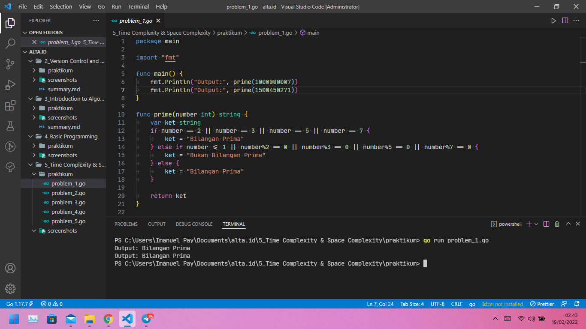
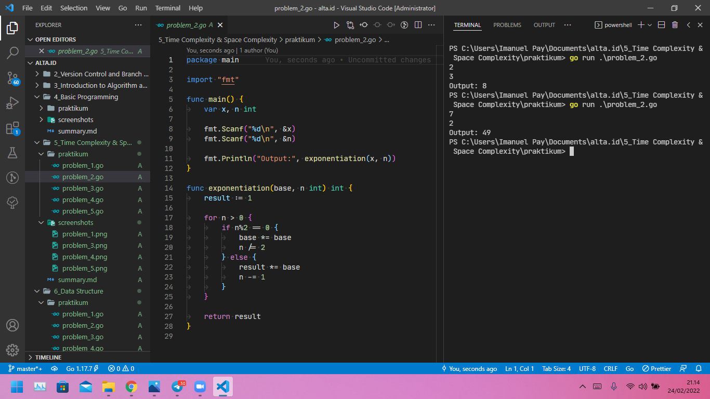
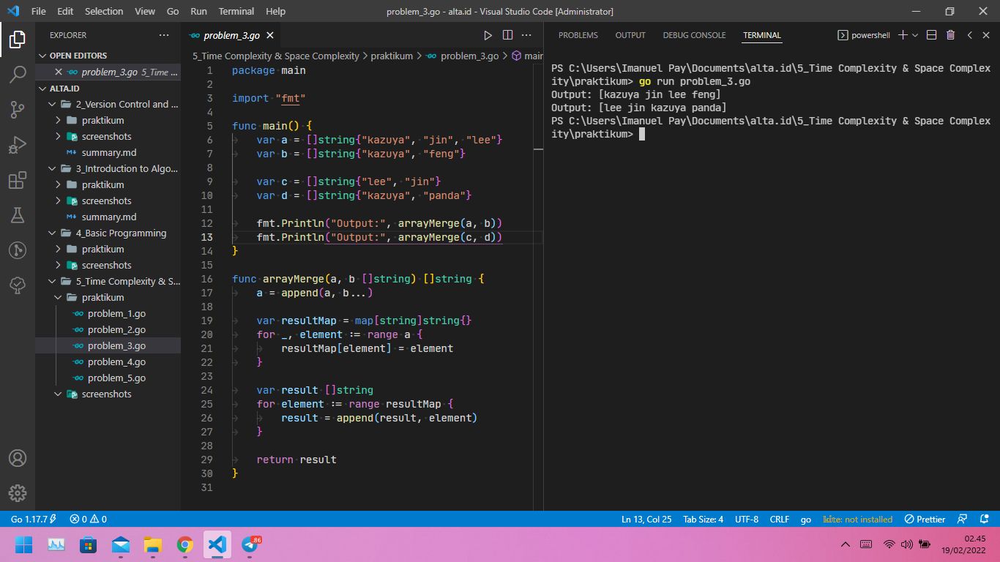
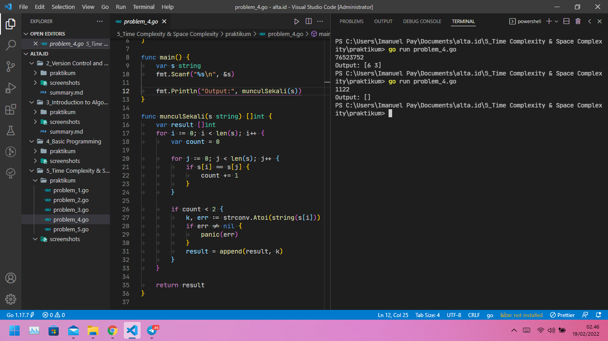
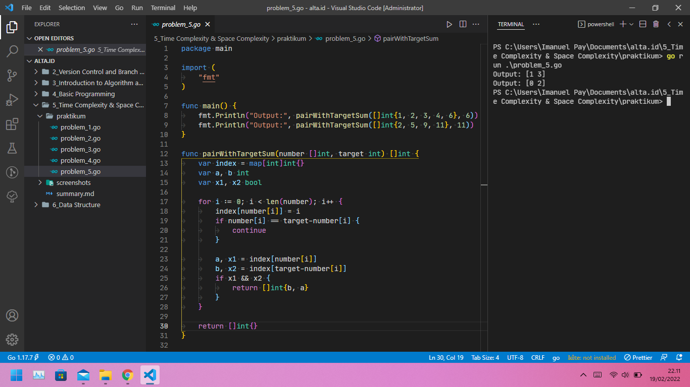

# (05) Time Complexity & Space Complexity

## Resume

+ `Time Complexity` digunakan untuk memudahkan memperkirakan waktu berjalan suatu program. Kompleksitas dapat dilihat dari jumlah maksimum program primitif yang dapat dijalankan oleh suatu program komputer seperti penambahan, perkalian, penugasan, dll, yang di deskripsikan sebagai Big-O notation.

+ Beberapa Time Complexity seperti: `Constant time - O(1)`, `Linear time - O(n) atau O(n + m)`, `Logarithmic time - O(log n)`, `Quadratic time - O(n^2)`. Untuk urutan Time Complexity terbaik adalah Constant time, Logarithmic time, Linear time, dan terakhir Quadratic time.

+ `Space Complexity` digunakan untuk memperkitakan batasan memory suatu program ketika di jalankan, yang berisi informasi tentang alokasi memori terhadap jumlah variabel yang dapat di deklarasikan dalam sebuah program.

### Constant time - O(1) pada Golang

Hanya satu kali di jalankan. Contoh:

```go
var hasil = 0
hasil += 10

```

### Linear time - O(n)

Dijalankan sebanyak n kali.
Contoh:

```go
for i := 0; i < n; i++ {
    // Operasi dominan
}

```

Ada juga Linear time - O(n + m).
Contoh:

```go
for i := 0; i < n; i++ {
    // Operasi dominan
}

for i := 0; i < m; i++ {
    // Operasi dominan
}
```

### Logarithmic time - O(log n)

Dijalakan setengah dari n atau n/2.
Contoh:

```go
for n < 1 {
    n /= 2
    // Operasi dominan
}
```

### Quadratic time - O(n^2)

Dijalankan sebanyak 2 kali lipat dari n atau n*n.
Contoh:

```go
for i := 0; i < n; i++ {
    for j := 0; j < n; j++ {
        // Operasi dominan
    }
}
```

## Task

### Problem 1 - Bilangan Prima

Solusi yang lebih optimal, dengan dengan kompleksitas lebih cepat dari O(n) / O(n/2) menurut saya adalah Constant time - O(1).

Berikut source code dari Problem 1 - Bilangan Prima menggunakan Constant time - O(1):

[probem_1.go](praktikum/problem_1.go)

Output:


### Problem 2 - Fast Exponentiation

Solusi yang lebih optimal, dengan dengan kompleksitas lebih cepat dari O(n) adalah O(n/2).

Berikut source code dari Problem 2 - Fast Exponentiation menggunakan O(n/2):

[probem_2.go](praktikum/problem_2.go)

Output:


### Problem 3 - Array Merge

Menggunakan struktur data tipe Map(tidak menggunakan algoritma BruteForce)

Berikut source code dari Problem 3 - Array Merge menggunakan struktur data tipe Map:

[probem_3.go](praktikum/problem_3.go)

Output:


### Problem 4 - Angka Muncul Sekali

Menggunakan Time Complexity Quadratic time - O(n^2)

Berikut source code dari Problem 4 - Angka Muncul Sekali menggunakan Time Complexity Quadratic time - O(n^2):

[probem_4.go](praktikum/problem_4.go)

Output:


### Problem 5 - Pair with Target Sum

Menggunakan Time Complexity Linear time - O(n)

Berikut source code dari Problem 5 - Pair with Target Sum menggunakan Time Complexity Linear time - O(n):

[probem_5.go](praktikum/problem_5.go)

Output:

