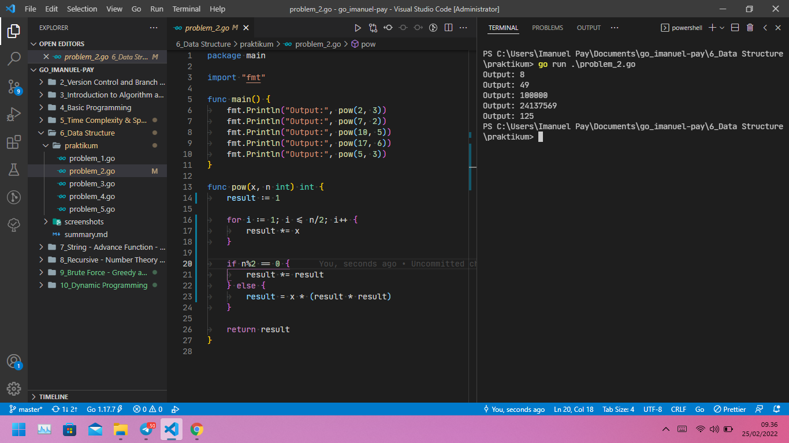

# (06) Data Structure

## Resume

+ Array adalah sebuah struktur data yang berisi kumpulan elemen bertipe data yang sama dengan ukuran alokasi tetap. Kumpulan variabel bertipe data sama dapat ditangani sebagai elemen array dengan tipe data seperti numeric, string, bool.

+ Slice adalah sebuah struktur data yang berisi kumpulan elemen bertipe data yang sama (sama seperti array), tetapi memiliki ukuran alokasi dinamis. Keyword append berfungsi untuk menambahkan data di dalam sebuah slice, sedangkan keyword copy digunakan untuk menyalin sebuah slice.

+ Map adalah sebuah struktur data penyimpanan data yang terdiri dari key dan value, key pada Map betipe unik. Sedangkan fungsi adalah potongan dari code program yang di panggil dengan sebuah nama. Dengan fungsi, memungkinkan kita menulis kode yang bersih, rapi dan modular.

### Struktur data Array pada Golang

```go
var array [5]int

// Deklarasi dan mengisi array dengan panjang array dinamis
array = [...]int{1, 2, 3, 4, 5}

// Deklarasi dan mengisi array
var array [5]int = [5]int{1, 2, 3, 4, 5}

// Deklarasi dan mengisi array tanpa keyword var
array := [5]int{1, 2, 3, 4, 5}

// Mengisi data dalam array spesifik
array[0] = 5
array[1] = 4
```

Untuk melihat output data dalam array bisa menggunakan keyword for range pada [Section 4 - Basic Programming](../4_Basic%20Programming/summary.md) bagian Looping

### Struktur data Slice pada Golang

Slice sama seperti array tapi dengan panjang data dinamis

```go
var slice []int

// Deklarasi slice kosong
var slice = []int{}

// Deklarasi dan mengisi slice
var slice = []int{1, 2, 3, 4, 5}

// Deklarasi dan mengisi slice tanpa keyword var
slice := []int{1, 2, 3, 4, 5}

// Menambahkan data dalam slice
slice = append(array, 1)
```

Untuk melihat output data dalam slice bisa menggunakan keyword for range pada [Section 4 - Basic Programming](../4_Basic%20Programming/summary.md) bagian Looping

### Struktur data Map pada Golang

```go

// Deklarasi map kosong
var nim = map[string]int{}

// Deklarasi dan mengisi map
var nim = map[string]int{"ImanuelPay": 1906080010}

// Menambahkan data dalam slice
nim["Imanuel Pay"] = 1906080010
```

Untuk melihat output data dalam slice bisa menggunakan keyword for range pada [Section 4 - Basic Programming](../4_Basic%20Programming/summary.md) bagian Looping

Untuk tipe data slice dan map, datanya dapat di isi mengunakan perulangan for.

### Function pada Golang

```go
// Function tanpa parameter
func name() {
 
}

// Function dengan parameter, tidak memiliki nilai balik
func name(name string) {
 
}

// Function dengan parameter, memiliki nilai balik
func name(name string) string {
    return name
}

// Function dengan parameter, lebih dari satu nilai balik
func name(name string) (string, string) {
    namaDepan := "Imanuel"
    namaBelakang := "Pay"
    return namaDepan, namaBelakang 
}
```

## Task

### Problem 1 - Bilangan Prima

Solusi yang lebih optimal, dengan dengan kompleksitas lebih cepat dari O(n) / O(n/2) menurut saya adalah Constant time - O(1).

Berikut source code dari Problem 1 - Bilangan Prima menggunakan Constant time - O(1):

[probem_1.go](praktikum/problem_1.go)

Output:


### Problem 2 - Fast Exponentiation

Solusi yang lebih optimal, dengan dengan kompleksitas lebih cepat dari O(n) adalah O(n/2).

Berikut source code dari Problem 2 - Fast Exponentiation menggunakan O(n/2):

[probem_2.go](praktikum/problem_2.go)

Output:


### Problem 3 - Array Merge

Menggunakan struktur data tipe Map(tidak menggunakan algoritma BruteForce)

Berikut source code dari Problem 3 - Array Merge menggunakan struktur data tipe Map:

[probem_3.go](praktikum/problem_3.go)

Output:


### Problem 4 - Angka Muncul Sekali

Menggunakan Time Complexity Quadratic time - O(n^2)

Berikut source code dari Problem 4 - Angka Muncul Sekali menggunakan Time Complexity Quadratic time - O(n^2):

[probem_4.go](praktikum/problem_4.go)

Output:


### Problem 5 - Pair with Target Sum

Menggunakan Time Complexity Linear time - O(n)

Berikut source code dari Problem 5 - Pair with Target Sum menggunakan Time Complexity Linear time - O(n):

[probem_5.go](praktikum/problem_5.go)

Output:

