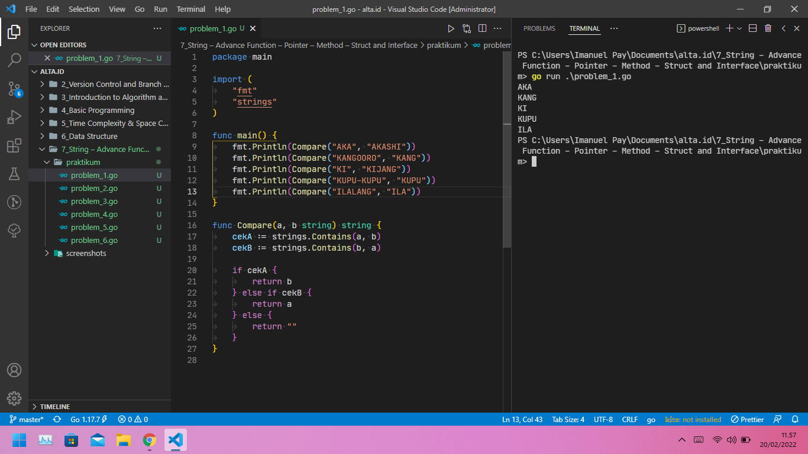
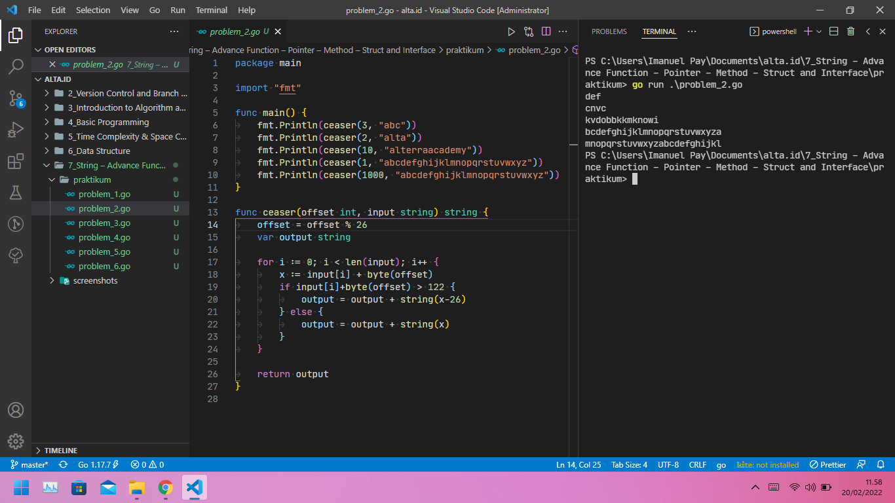
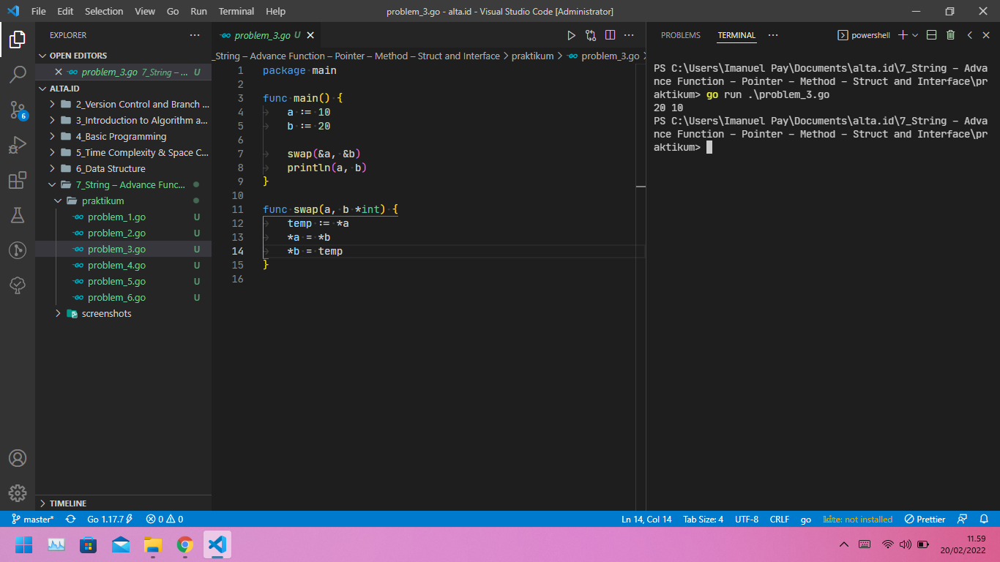
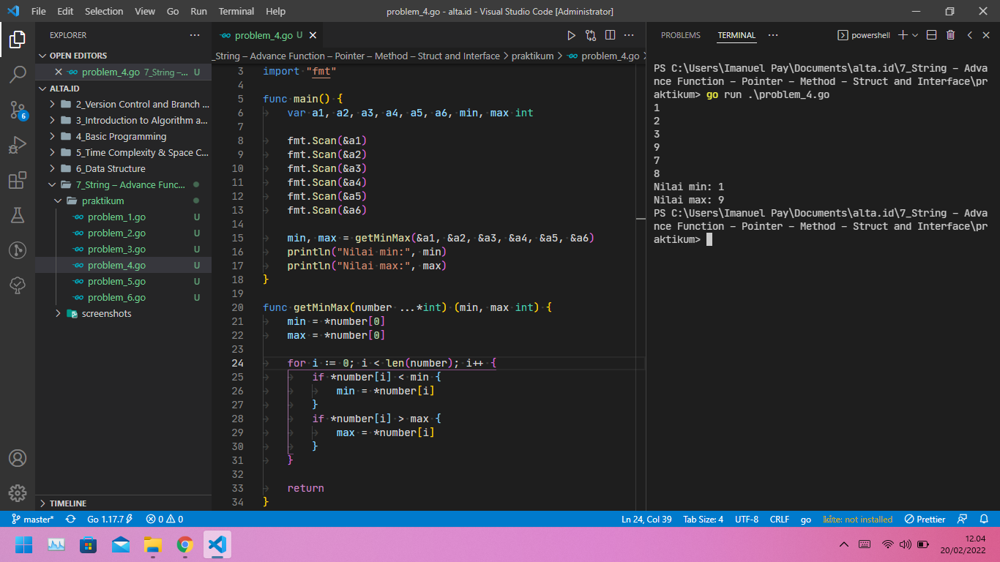
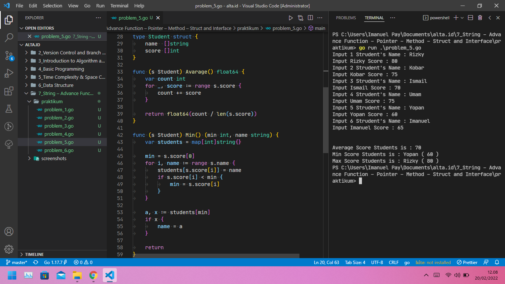
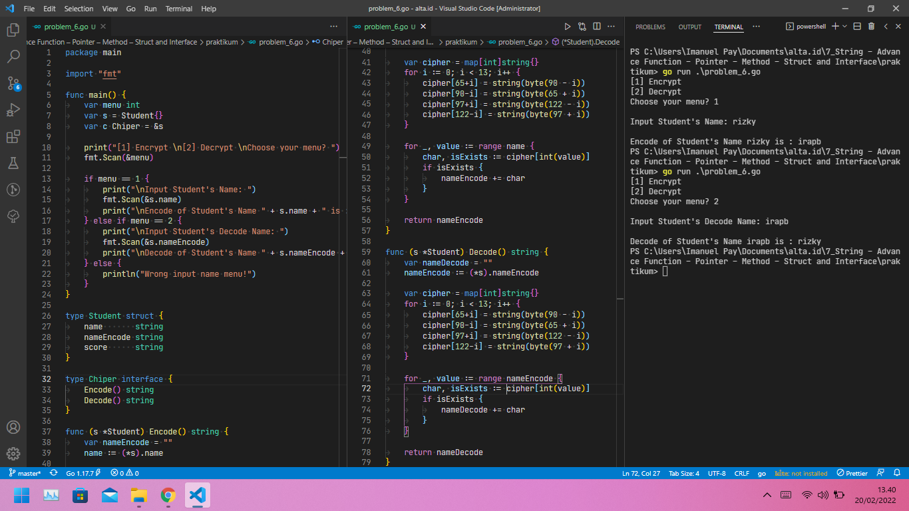

# (07) String - Advance Function - Pointer - Method - Struct and Interface

## Resume

+ Bekerja dengan string, dapat dilakukan dengan beberapa fungsi, diantaranya: Fungsi `len` digunakan untuk mengetahui panjang sebuah string, Fungsi `compare` digunakan untuk membandingkan 2 buah string, Fungsi `contains` digunakan untuk mengecek substring atau bagian dari sebuah string, Fungsi `substring` digunakan untuk memecah sebuah string, menjadi string baru, Fungsi `replace` digunakan untuk mengganti beberapa karakter dalam sebuah string, Fungsi `insert` digunakan untuk memasukkan atau menambahkan string ke dalam string.

+ Dibagian fungsi tingkat lanjut, terdapat beberap fungsi yang harus dipelajari, diantaranya: Variadic Function: fungsi dengan parameter tak terbatas dengan memiliki sifat seperti slice. Anonymous atau Literal Function: fungsi tanpa nama dan sangat berguna jika ingin membuat suatu fungsi dalam satu baris. Closure Function: tipe spesial dari Anonymous Function yang dapat mendeklarasi sebuah variabel di luar fungsi itu sendiri. Defer Function: fungsi yang hanya di eksekusi setelah induk fungsi telah selesai yang bekerja seperti stack.

+ Pointer sebuah variabel yang dapat menyimpan alamat memori dari variabel lain, untuk deferencing menggunakan tanda * dan referencing menggunakan tanda &. Untuk mengimplementasi Pemrograman Berbasis Objek pada Golang, dapat menggunakan struct, method (ditempel pada struct), dan interface.

### String pada Golang

Import terlebih dahulu package strings

```go
package main

// Multiple Import
import (
 "fmt"
 // Import package strings
 "strings"
)

func main() {
    hero1 := "PopolKupa"
    hero2 := "Popol"

    // len string
    fmt.Println(len(hero1)) // Output: 9

    // compare string
    fmt.Println(hero1 == hero2) // Output: false

    // contains string
    fmt.Println(strings.Contains(hero1, hero2)) // Output: true

    // substring
    fmt.Println(hero1[5:]) // Output: Kupa

    // replace
    fmt.Println(strings.Replace(hero2, "o", "u", -1)) // Output: Pupul

    // insert
    fmt.Println(hero1[:5] + " dan " + hero1[5:]) // Output: Popol dan Kupa
}
```

### Advance Function pada Golang

Fungsi Variadic pada Golang:

```go
func main() {
    fmt.Println(calculate(1, 2, 3, 4, 5))
}

func calculate(numbers ...int) avg float64 {
    // Lakukan perhitungan
    return
}
```

Fungsi Closure pada Golang:

```go
func main() {
    var getMinMax = func(n []int) (int, int) {
        var min, max int
        // Lakukan perhitungan
        return min, max
    }

    var numbers = []int{2, 3, 4, 3, 4, 2, 3}
    var min, max = getMinMax(numbers)
    fmt.Printf(min, max)
}
```

Fungsi Anonymous pada Golang:

```go
func main() {
    func() {
        fmt.Println("Imanuel Pay")
    }()
}
```

### Pointer pada Golang

```go
name := "Imanuel"

// Mengambil Alamat memori dari varibel name
// Penulisan lengkap: var nameAddres *string

nameAddress := &name

// Simbol &: untuk alamat memori
// Simbol *: untuk nilai yang disimpan pada memori
```

### Penerapan OOP pada Golang

```go
// Membuat Struct
type Mahasiswa struct {
    nama string
    nim  string
}

// Membuat Interface
type IMahasiswa interface {
    getNamaDanNim() int
}

// Membuat Method
func (m Mahasiswa) getNamaDanNim() string {
    return "NIM: " + m.nim + ", Nama: " + m.nama
}

func main() {
    // Deklarasi Struct
    m := Mahasiswa{
        nim:  "1906080010",
        nama: "Imanuel Pay",
    }

    // Pemanggilan Method
    fmt.Println(m.getNamaDanNim())
}
```

## Task

### Problem 1 - Compare String

Berikut source code dari Problem 1 - Compare String:

[problem_1.go](praktikum/problem_1.go)

Output:



### Problem 2 - Caesar Cipher

Berikut source code dari Problem 2 - Caesar Cipher:

[problem_2.go](praktikum/problem_2.go)

Output:



### Problem 3 - Swap Two Number Using Pointer

Berikut source code dari Problem 3 - Swap Two Number Using Pointer:

[problem_3.go](praktikum/problem_3.go)

Output:



### Problem 4 - Min and Max Using Pointer

Berikut source code dari Problem 4 - Min and Max Using Pointer:

[problem_4.go](praktikum/problem_4.go)

Output:



### Problem 5 - Students Score

Berikut source code dari Problem 5 - Students Score:

[problem_5.go](praktikum/problem_5.go)

Output:



### Problem 6 - Substitution Cipher

Berikut source code dari Problem 6 - Substitution Cipher:

[problem_6.go](praktikum/problem_6.go)

Output:


