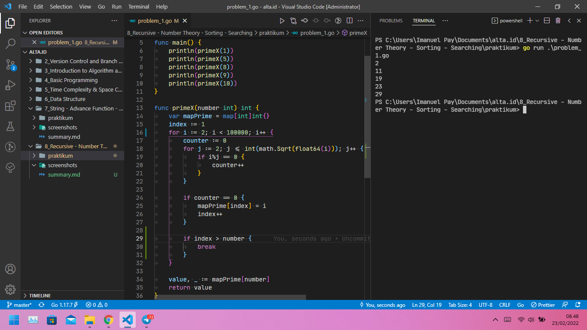
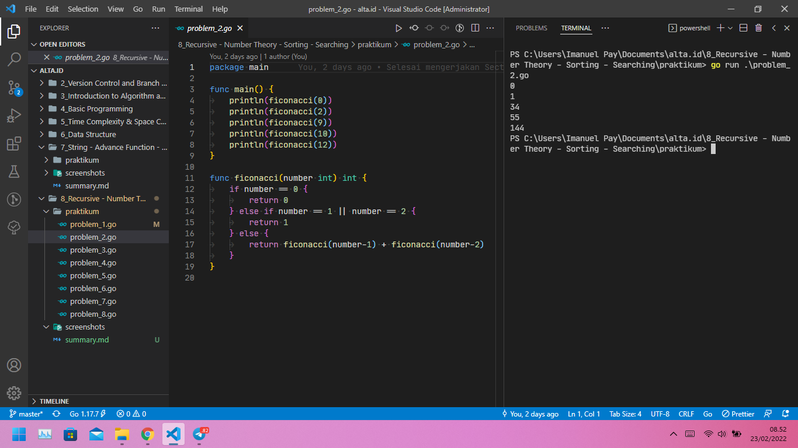
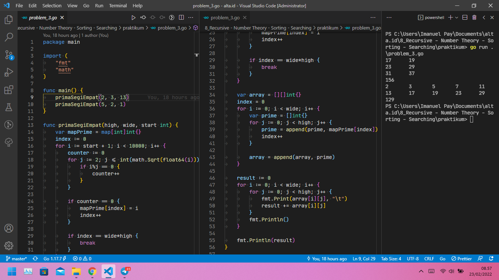
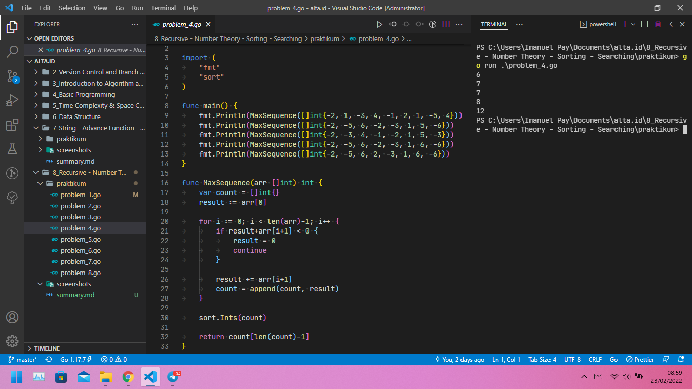
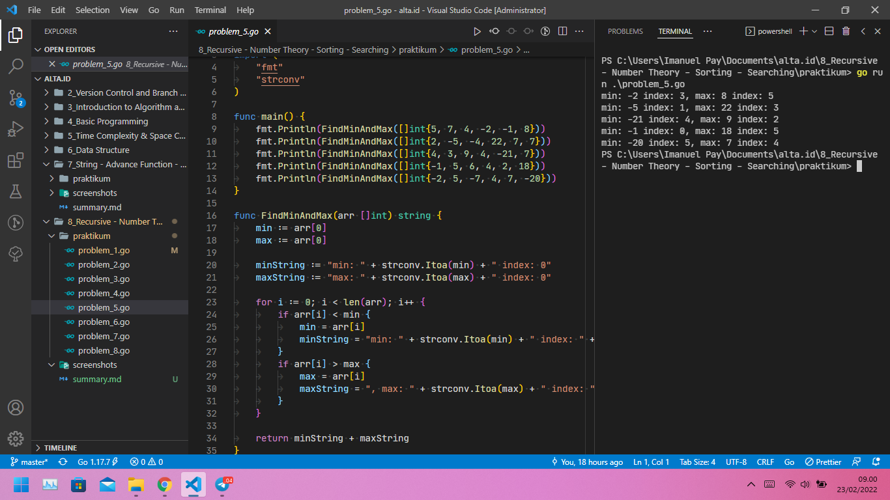
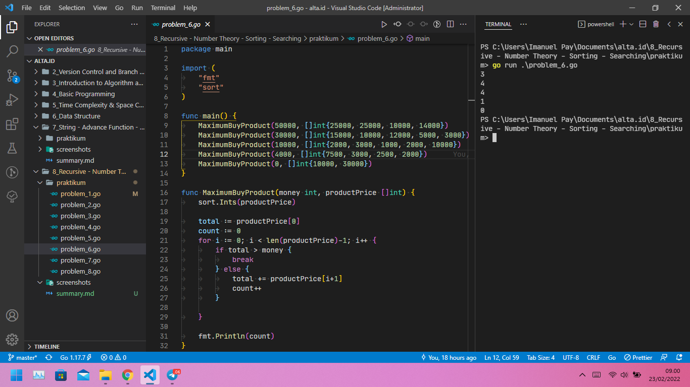
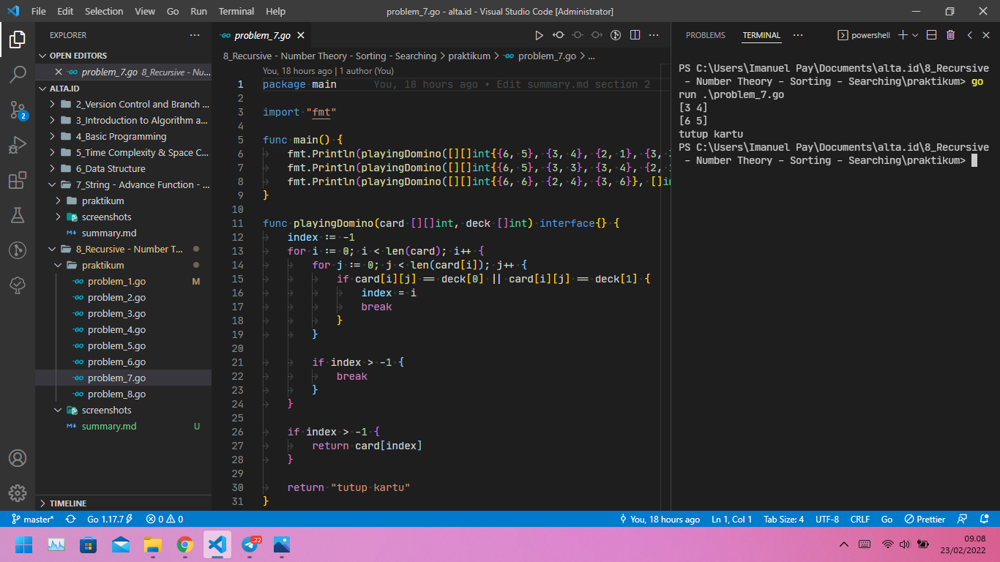

# (08) Recursive - Number Theory - Sorting - Searching

## Resume

+ `Fungsi Rekursif` adalah fungsi yang memiliki konsep seperti perulangan namun dengan memanggil dirinya sendiri. Pada saat menggunakan fungsi Rekursif, kita perlu berhati-hati dalam mengatur kondisi berhenti dari fungsi, jika tidak maka akan menjadi loop tak terbatas. Contoh penggunaan fungsi Rekursif adalah untuk menghitung faktorial suatu angka atau menghasilkan deret Fibonacci.

+ `Number Theory` adalah sebuah cabang matematika yang mempelajari bilngan bulat. Topik yang paling banyak di bahas dalam Number Theory adalah Bilangan Prima, Kelipatan Persekutuan Terkecil, Faktor Persekutuan Terbesar, Faktorial, Faktor Prima, dll.

+ `Searching` atau pencarian adalah proses menemukan sebuah sebuah nilai di dalam sebuah daftar nilai. Dalam bahasa pemrograman Golang, sudah terdapat Builtins search. Sedangkan Sorting adalah proses menyusun data dalam urutan tertentu. Sorting bisa di lakukan pada angka, kata, dll.

### Fungsi Rekursif dan Number Theory pada Golang

Fungsi Rekursif:

```go
func main() {
    Rekursif()
}

func Rekursif() {
    Rekursif()
}
```

Contoh Fungsi Rekursif untuk menghitung faktorial suatu angka:

```go
package main

import "fmt"

func main() { 
    fmt.Printf(factorial(15))
}

func factorial(i int)int {
    if(i <= 1) {
        return 1
    }

    return i * factorial(i - 1)
}
```

### Searching dan Sorting pada Golang

Contoh penerapan Searching pada Golang dengan menggunakan Linear Search O(n):

```go
func LinearSearch(data []int, x int) int {
    for i := 0; i < len(data); i++ {
        if data[i] == x {
            return i
        }
    }

    return -1
}
```

Contoh penerapan Sorting pada Golang dengan menggunakan Linear Search O(n<sup>2</sup>):

```go
func SelectionSort(data []int) []int {
    for i := 0; i < len(data); i++ {
        min := i
        for j := i+1; j < len(data); j++ {
            if data[j] < data[min] {
                min = j
            }
        }

        data[i], data[min] = data[min], data[i]
    }

    return data
}
```

Untuk Builtins search dan Builtins sorting pada Golang, import dahulu packge `sort`

## Task

### Problem 1 - Prime ke X

Berikut source code dari Problem 1 - Prime ke X:

[problem_1.go](praktikum/problem_1.go)

Output:



### Problem 2 - Fibonacci

Berikut source code dari Problem 2 - Fibonacci:

[problem_2.go](praktikum/problem_2.go)

Output:



### Problem 3 - Prima Segi Empat

Berikut source code dari Problem 3 - Prima Segi Empat:

[problem_3.go](praktikum/problem_3.go)

Output:



### Problem 4 - Total Maksimum dari Deret Bilangan

Berikut source code dari Problem 4 - Total Maksimum dari Deret Bilangan:

[problem_4.go](praktikum/problem_4.go)

Output:



### Problem 5 - Find Min and Max Number

Berikut source code dari Problem 5 - Find Min and Max Number:

[problem_5.go](praktikum/problem_5.go)

Output:



### Problem 6 - Maximum Buy Product

Berikut source code dari Problem 6 - Maximum Buy Product:

[problem_6.go](praktikum/problem_6.go)

Output:



### Problem 7 - Playing Domino

Berikut source code dari Problem 7 - Playing Domino:

[problem_7.go](praktikum/problem_7.go)

Output:



### Problem 8 - Most Appear Item

Berikut source code dari Problem 8 - Most Appear Item:

[problem_8.go](praktikum/problem_8.go)

Output:


