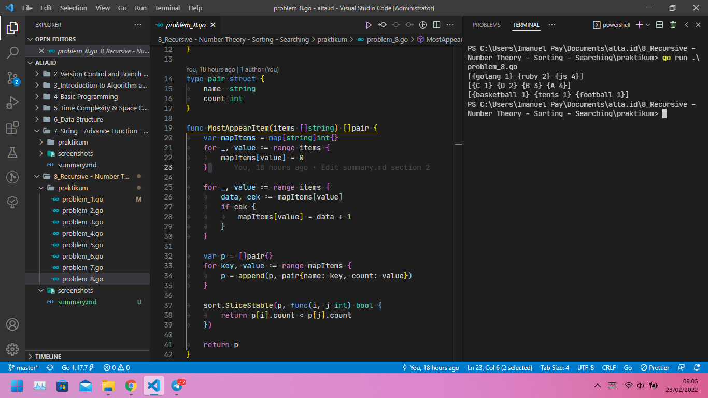

# (08) Recursive - Number Theory - Sorting - Searching

## Resume

## Task

### Problem 1 - Prime ke X

Berikut source code dari Problem 1 - Prime ke X:

[problem_1.go](praktikum/problem_1.go)

Output:

### Problem 2 - Fibonacci

Berikut source code dari Problem 2 - Fibonacci:

[problem_2.go](praktikum/problem_2.go)

Output:

### Problem 3 - Prima Segi Empat

Berikut source code dari Problem 3 - Prima Segi Empat:

[problem_3.go](praktikum/problem_3.go)

Output:

### Problem 4 - Total Maksimum dari Deret Bilangan

Berikut source code dari Problem 4 - Total Maksimum dari Deret Bilangan:

[problem_4.go](praktikum/problem_4.go)

Output:

### Problem 5 - Find Min and Max Number

Berikut source code dari Problem 5 - Find Min and Max Number:

[problem_5.go](praktikum/problem_5.go)

Output:

### Problem 6 - Maximum Buy Product

Berikut source code dari Problem 6 - Maximum Buy Product:

[problem_6.go](praktikum/problem_6.go)

Output:

### Problem 7 - Playing Domino

Berikut source code dari Problem 7 - Playing Domino:

[problem_7.go](praktikum/problem_7.go)

Output:

### Problem 8 - Most Appear Item

Berikut source code dari Problem 8 - Most Appear Item:

[problem_8.go](praktikum/problem_8.go)

Output:

