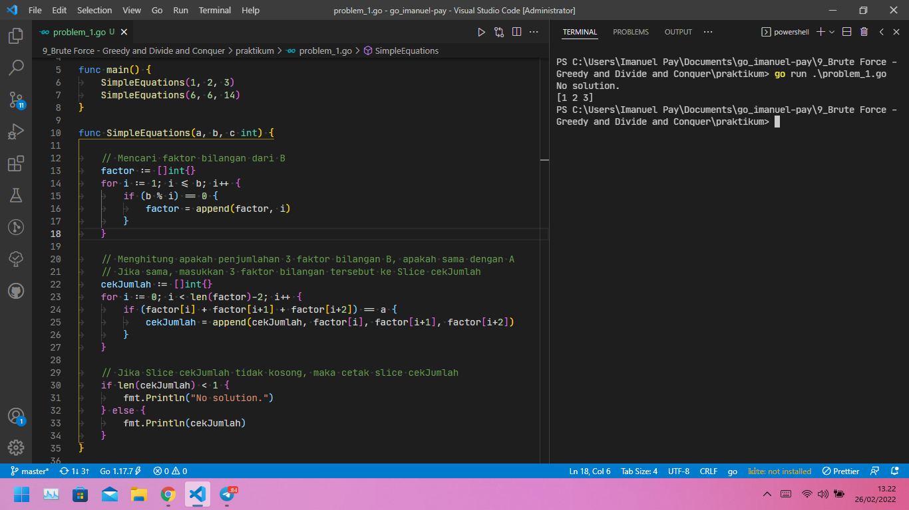
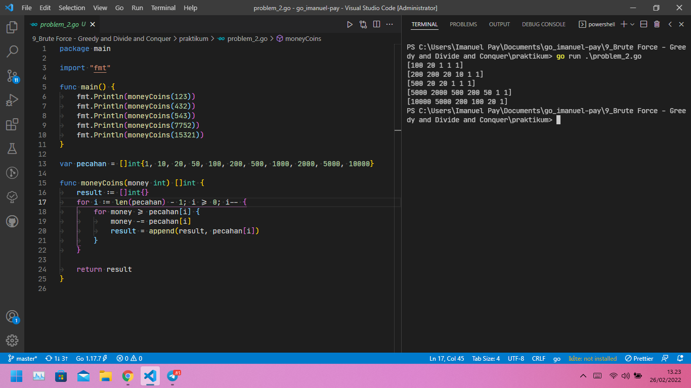
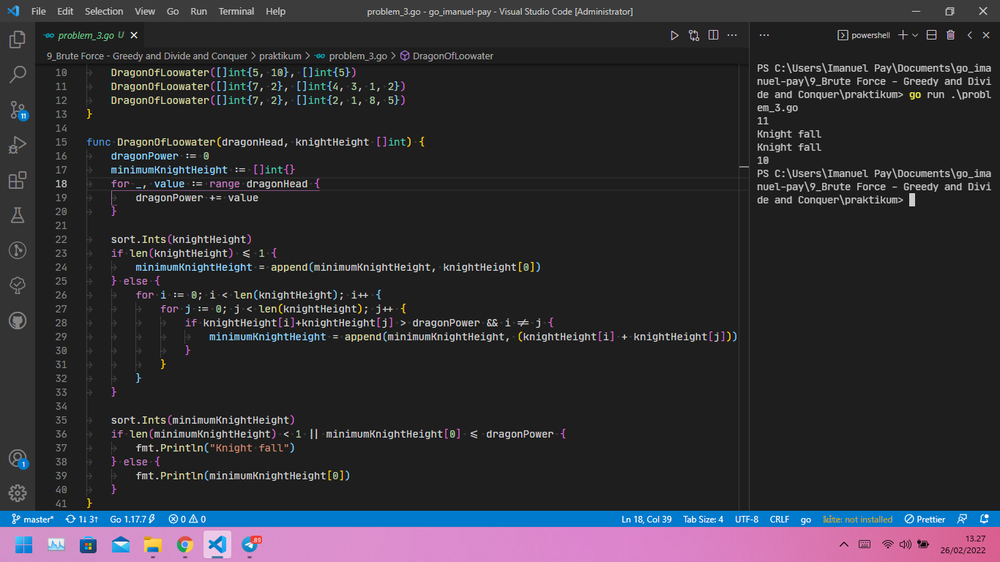
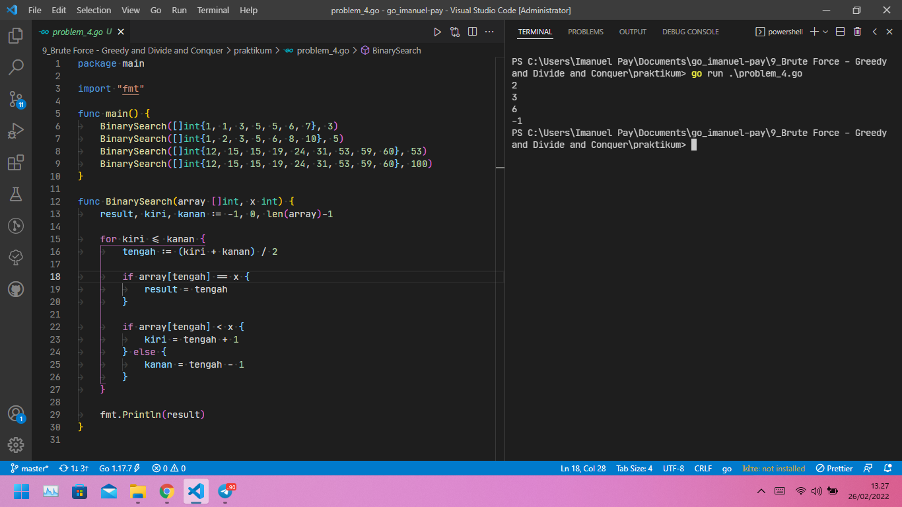

# Brute Force - Greedy - Divide and Conquer

## Resume

Problem Solving Paradigms adalah pendekatan yang biasa digunakan untuk memecahkan masalah, seperti: Complete Search (Brute Force), Divide and Conquer, Greedy dan Dynamic Programming. Setiap masalah perlu diselesaikan dengan pendekatan yang sesuai.

+ Complete Search (Brute Force) adalah sebuah metode untuk menyelesaikan sebuah masalah dengan mengecek seluruh ruang pencarian untuk mendapatkan solusi yang diperlukan atau di butuhkan. Brute Force digunakan ketika sudah tidak ada algoritma yang dapat menyelesaikan masalah tersebut. Brute Force juga biasanya mudah untuk dibuat karena sederhana dan tidak berbelit-belit.

+ Divide and Conquer (D&C) adalah sebuah paradigma penyelesaian masalah di mana suatu masalah dibuat lebih sederhana dengan membaginya menjadi bagian-bagian yang lebih kecil dan kemudian menyelesaikan setiap bagian kecil tersebut. Langkah-langkah Divide and Conquer (D&C)
  + Divide: membagi masalah yang besar menjadi lebih kecil.
  + Conquer: ketika masalah sudah cukup kecil maka langsung diselesaikan.
  + Combine: menggabungkan solusi dari masalah-masalah yang lebih kecil menjadi solusi untuk masalah yang besar.
  
+ Greedy adalah sebuah algoritma dikatakan serakah dengan membuat pilihan lokal yang optimal pada setiap langkah dengan harapan akhirnya mencapai solusi global yang optimal.

> Brute Force - Greedy - Divide and Conquer pada Golang dapat di lihat pada task.

## Task

### Problem 1 - Simple Equations

Berikut source code dari Problem 1 - Simple Equations menggunakan Brute Force:

[problem_1.go](praktikum/problem_1.go)

Output:

### Problem 2 - Money Coins

Berikut source code dari Problem 2 - Money Coins menggunakan Greedy:

[problem_2.go](praktikum/problem_2.go)

Output:

### Problem 3 - Dragon of Loowater

Berikut source code dari Problem 3 - Dragon of Loowater menggunakan Brute Force:

[problem_3.go](praktikum/problem_3.go)

Output:

### Problem 4 - Binary Search Algorithm

Berikut source code dari Problem 4 - Binary Search Algorithm menggunakan Divide and Conquer:

[problem_4.go](praktikum/problem_4.go)

Output:

